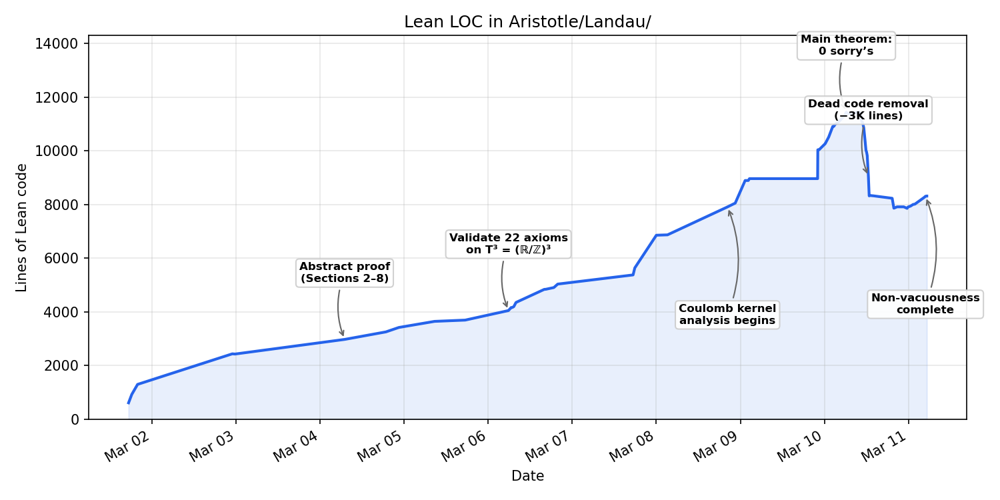

# Formal Verification of the Vlasov-Maxwell-Landau Steady-State Theorem

A complete formalization in [Lean 4](https://lean-lang.org/) + [Mathlib](https://leanprover-community.github.io/mathlib4_docs/) of the characterization of smooth steady-state solutions to the **Vlasov-Maxwell-Landau (VML) system** with Coulomb collisions on the 3-torus.

**Status: fully verified by the Lean 4 kernel. 0 sorry's across 22 files (~8,300 lines).**

[Documentation](https://vilin97.github.io/aristotle/blueprint/) | [Dependency graph](https://vilin97.github.io/aristotle/blueprint/dep_graph_document.html)

## The Mathematics

### The Physical System

The Vlasov-Maxwell-Landau system models the dynamics of a charged plasma. The unknowns are:
- **f(x, v)**: the particle distribution function (density of particles at position x with velocity v)
- **E(x)**: the electric field
- **B(x)**: the magnetic field

The equations couple the Vlasov kinetic equation (particle transport under electromagnetic forces and collisions) with Maxwell's equations (electromagnetic field evolution):

```
v · ∇ₓf + (E + v × B) · ∇ᵥf = ν · Q(f, f)     (Vlasov)
curl B = J = ∫ v f dv                             (Ampere)
div E = ∫ f dv - ρ_ion                            (Gauss)
div B = 0                                          (Solenoidal)
```

The **Landau collision operator** Q(f, f) models binary Coulomb collisions:

```
Q(f, f)(v) = ∇ᵥ · ∫ A(v - w) [f(w)∇ᵥf(v) - f(v)∇ᵥf(w)] dw
```

where **A(z) = Ψ(|z|)(|z|²I - zz^T)** is the Landau collision matrix with the Coulomb kernel **Ψ(r) = r⁻³**.

### The Main Theorem

> **Theorem (CoulombConcreteTheorem42).** Let f > 0 be a smooth steady-state solution of the VML system with Coulomb collisions on T³ = (R/Z)³, with Schwartz-class velocity decay and a stretched-exponential lower bound. Then:
>
> 1. **f is a spatially uniform Maxwellian:** f(x, v) = ρ_ion / (2πT)^(3/2) · exp(-|v|² / 2T) for some T > 0
> 2. **The electric field vanishes:** E(x) = 0 everywhere
> 3. **The magnetic field is constant:** B(x) = B₀ for some constant B₀

In other words: the only smooth positive steady states are global thermodynamic equilibria. This is a rigidity result fundamental to plasma confinement theory.

### Hypotheses

The formal theorem takes 13 hypotheses:

| # | Hypothesis | Description |
|---|-----------|-------------|
| 1 | `hν` | Collision frequency ν > 0 |
| 2 | `hρ_ion` | Ion background density ρ_ion > 0 |
| 3 | `hf_pos` | Strict positivity: f(x, v) > 0 for all x, v |
| 4 | `hf_smooth_v` | f is C^∞ in velocity |
| 5 | `hf_smooth_x` | f is C^∞ in space (via periodic lift) |
| 6 | `hB_smooth` | B is C^∞ in space |
| 7 | `hSchwartz` | Schwartz decay in v: \|D^k f(x,v)\| · (1+\|v\|)^N ≤ C for all N, k |
| 8 | `hExpDecay` | Stretched-exponential lower bound: f ≥ exp(-C(1+\|v\|)^K) |
| 9 | `hGradBound` | Polynomial score bound: \|∂f/∂vᵢ\| ≤ Cg(1+\|v\|)^Kg · f |
| 10 | `hVlasov` | Steady-state Vlasov equation |
| 11 | `hAmpere` | Ampere's law |
| 12 | `hGauss` | Gauss's law |
| 13 | `hDivB` | Divergence-free magnetic field |

**Note on minimality:** Hypothesis 9 (polynomial score bound) is likely derivable from hypotheses 7-8 (Schwartz decay + exponential lower bound), making the list 12-independent. Formalizing this derivation is nontrivial and was deferred.

### Proof Architecture

The proof decomposes into 7 mathematically distinct steps, following a classical entropy method:

```
Section 2: Landau matrix A(z) is positive semi-definite
    ↓
Section 3: H-theorem → entropy dissipation D(f) ≤ 0
    ↓ D = 0 ⟹ f is Maxwellian (nullspace characterization)
Section 4: Vlasov transport → f is a LOCAL Maxwellian at each x
    ↓
Section 5: Polynomial matching → temperature T is constant
    ↓
Section 6: Killing's equation → bulk velocity u is constant
    ↓
Section 7: Maximum principle → u = 0 and E = 0
    ↓
Section 8: Harmonic analysis on T³ → B is constant
```

**Key mathematical insight (Coulomb singularity cancellation):** The Coulomb kernel Ψ(r) = r⁻³ is singular at r = 0, making the collision matrix A(z) diverge. However, the PSD integrand — which controls entropy dissipation — remains continuous because the score difference cancels the singularity:

```
|∇log f(v) - ∇log f(w)| = O(|v - w|)  cancels  Ψ(|v-w|) = O(|v-w|⁻³)
```

yielding a PSD integrand of order O(|v-w|), which vanishes on the diagonal.

## Project Structure

### File Overview

The formalization consists of **22 Lean files** in `Aristotle/Landau/main/`:

#### Abstract Framework
| File | Lines | Content |
|------|------:|---------|
| `Defs.lean` | 761 | Core definitions: `FlatTorus3` typeclass, `landauMatrix`, `LandauOperator`, `PSDIntegrand`, `equilibriumMaxwellian`, `VMLInput`, `VMLSteadyState` |
| `Section2.lean` | 141 | Landau matrix algebra: PSD, evenness, quadratic form characterization |
| `Section3.lean` | 193 | H-theorem: D(f) ≤ 0, nullspace characterization Q=0 ⟹ Maxwellian |
| `Section3Helpers.lean` | 637 | Supporting lemmas for Section 3 (Fubini symmetrization, IBP chain) |
| `Section4.lean` | 353 | Transport constraints: steady state → local Maxwellian |
| `Section5.lean` | 163 | Polynomial matching: constant temperature |
| `Section6.lean` | 47 | Killing's equation: constant bulk velocity |
| `Section7.lean` | 208 | Maximum principle: E = 0, u = 0 |
| `Section8.lean` | 38 | Harmonic closure: B constant on T³ |
| `VMLInputDerive.lean` | 436 | Maxwellian parameter extraction and polynomial identity decomposition |
| `Theorem42.lean` | 302 | Main abstract theorem with `VelocityDecayConditions` bundle (19 fields) |

#### Torus Instance
| File | Lines | Content |
|------|------:|---------|
| `TorusInstance.lean` | 1,162 | Concrete `FlatTorus3` instance on T³ = Fin 3 → AddCircle 1 (validates all 22 abstract axioms) |

#### Coulomb Kernel (Concrete Instance)
| File | Lines | Content |
|------|------:|---------|
| `CoulombKernel.lean` | 113 | Coulomb kernel Ψ(r) = r⁻³, positivity, Schwartz helpers |
| `CoulombSpatialTransport.lean` | 662 | Spatial/force transport integrability for Coulomb |
| `NewtonianPotential.lean` | 283 | Matrix entry bound \|A_{ij}(z)\| ≤ \|z\|⁻¹, inverse-norm local integrability |
| `CoulombFlux.lean` | 589 | Landau flux integrability, flux×log, flux component bounds |
| `CoulombFluxDiff.lean` | 631 | Flux differentiability, convolution derivatives, IBP conditions |
| `CoulombPSD.lean` | 703 | PSD continuity (singularity cancellation), pointwise bounds, Fubini |
| `CoulombConcreteTheorem42.lean` | 288 | **Main theorem** — assembles all 19 `VelocityDecayConditions` fields |
| `LandauMatrixDerivBound.lean` | 396 | Aristotle-proved matrix derivative bound with bridging lemmas |

#### Supporting
| File | Lines | Content |
|------|------:|---------|
| `SchwartzDecayDefs.lean` | 118 | `UniformSchwartzDecay` definition, polynomial integrability helpers |
| `VelocityDecayInstance.lean` | 35 | Lorentz force component bound (proved by Aristotle) |

### Dependency Graph

```
Theorem42 (abstract)
  ├─ Sections 2-8 + VMLInputDerive
  └─ Defs (FlatTorus3 typeclass)

CoulombConcreteTheorem42 (concrete)
  ├─ Theorem42 (abstract result)
  ├─ TorusInstance (FlatTorus3 on T³)
  ├─ CoulombSpatialTransport
  │    ├─ CoulombKernel
  │    └─ VelocityDecayInstance
  ├─ CoulombFlux
  │    └─ NewtonianPotential
  │         └─ CoulombKernel
  ├─ CoulombPSD
  │    └─ CoulombFlux
  └─ CoulombFluxDiff
       └─ CoulombFlux
```

### Design: Abstract vs. Concrete

The formalization separates **abstract structure** from **concrete computation**:

- **`FlatTorus3 X`** is a typeclass with 22 axiom fields characterizing a flat compact 3-manifold (differential operators, integration axioms, Fubini, IBP, harmonic characterization, Killing equations). The entire Sections 2-8 proof chain is stated abstractly over `FlatTorus3 X`.

- **`TorusInstance`** validates all 22 axioms for the concrete torus T³ = Fin 3 → AddCircle 1, where functions are automatically periodic and differential operators are defined via the periodic lift.

- **`VelocityDecayConditions`** is a 19-field structure bundling all the integrability, continuity, and differentiability conditions that the abstract proof needs from the collision kernel. Sections 2-8 never mention the kernel directly — they only use these conditions.

- The **Coulomb files** prove all 19 fields for the Coulomb kernel Ψ(r) = r⁻³, handling the singularity explicitly.

This architecture means the abstract proof would apply to any collision kernel (e.g., hard/soft potentials) once the corresponding `VelocityDecayConditions` are verified.

## Building

### Prerequisites

- [Lean 4](https://lean-lang.org/lean4/doc/setup.html) (v4.24.0)
- [Lake](https://github.com/leanprover/lean4/tree/master/src/lake) (bundled with Lean)

### Build

```bash
lake exe cache get   # download prebuilt Mathlib oleans
lake build           # build the project (~2-5 min)
```

If the build seems to be rebuilding Mathlib from scratch (>30s), run:

```bash
lake clean && lake update && lake exe cache get && lake build
```

## Development Process

This formalization was developed by a human mathematician ([Vasily Ilin](https://github.com/Vilin97)) working collaboratively with [Claude Code](https://docs.anthropic.com/en/docs/claude-code) (Anthropic's AI coding agent) and [Aristotle](https://aristotle.harmonic.fun/) (Harmonic's automated theorem prover).

### The `/babysit` Loop

Development was organized around an automated **babysit cycle** — a repeating loop of:

1. **`/critique`** — adversarial review of the codebase, identifying sorry's, dead code, documentation drift, and architectural issues
2. **`/plan`** — prioritize work items based on the critique
3. **`/prove`** — hands-on theorem proving: close sorry's, fix proofs, write new lemmas
4. **`/simplify`** — refactor proofs, eliminate unnecessary heartbeat overrides, remove dead code
5. **`/submit-aristotle`** — extract hard lemmas and submit to Aristotle for automated proving
6. **`/check-aristotle`** — poll for completed Aristotle jobs and integrate solutions
7. **`/log`** — record what was accomplished in `LOG.md`

This loop ran for **58 cycles** over the course of the project. The development log (`Aristotle/Landau/LOG.md`, ~70KB) records every cycle.

### Aristotle Integration

[Aristotle](https://aristotle.harmonic.fun/) is Harmonic's cloud-based automated theorem prover for Lean 4. It was used for lemmas that were:
- Tedious to prove by hand (e.g., `lorentz_component_bound`)
- Required sophisticated integration arguments (e.g., `landau_flux_integrable_coulomb`, `psd_continuous_coulomb`)
- Needed counterexample construction (e.g., negated `force_entropy_integrable` via Vitali set)

Over the project, **50 jobs** were submitted to Aristotle:
- **8 lemmas fully proved** by Aristotle and integrated into the codebase
- **18 lemmas proved manually** after Aristotle failed or timed out
- **8 submissions negated** (statement was false) or returned errors

Key Aristotle-proved results include:
- `inv_norm_local_integrable`: ‖z‖⁻¹ is locally integrable in R³
- `convolution_local_int_schwartz`: convolution of ‖·‖⁻¹ with a Schwartz function is integrable
- `psd_continuous_coulomb`: the PSD integrand is continuous despite the Coulomb singularity
- `landau_flux_integrable_coulomb`: the Landau flux is integrable for Coulomb

### Lines of Code Over Time



**Figure: Lean lines of code in `Aristotle/Landau/` across all 83 commits.** The project progressed in four phases. (1) **Abstract proof chain** (Mar 3–6): the mathematical argument (Sections 2–8) was formalized against an abstract `FlatTorus3` typeclass, and all 22 axioms were validated on the concrete torus T³ = (ℝ/ℤ)³. (2) **Coulomb kernel analysis** (Mar 7–9): the sharp LOC increase reflects the hard analytical work — proving integrability, differentiability, and continuity of the Landau collision operator for the Coulomb kernel Ψ(r) = r⁻³, which required handling the singularity at r = 0. This phase produced ~6K lines across `VelocityDecayInstance`, `CoulombFlux`, `CoulombPSD`, `CoulombFluxDiff`, and `CoulombConcreteTheorem42`, closing all 16 sorry's in the concrete theorem with help from [Aristotle](https://aristotle.harmonic.fun/). (3) **Cleanup** (Mar 10, early): 30+ commits systematically removed ~3K lines of dead code, redundant lemmas, unnecessary heartbeat overrides, and linter suppressions. (4) **Non-vacuousness** (Mar 10, late): a separate theorem proving that the hypotheses are satisfiable (the equilibrium Maxwellian with E = 0, B = 0 witnesses all 13 conditions). Generated by `scripts/loc_history.py`.

### Timeline Highlights

| Phase | Sorry Count | Key Milestone |
|-------|------------|---------------|
| Initial formalization | ~50+ | Abstract proof chain stated, many gaps |
| Concrete torus instance | ~30 | FlatTorus3 validated on T³ |
| Coulomb kernel split | ~16 | Single 1827-line file split into 6 |
| Aristotle integration | 14 → 8 | Automated proofs for key integrability lemmas |
| Manual closing | 8 → 0 | Joint measurability, IBP, PSD bounds proved by hand |
| Cleanup (cycles 52-58) | 0 | Dead code removal (-2000 lines), heartbeat elimination |

## Known Limitations

- **Hypothesis 9 (hGradBound) is likely redundant:** The polynomial score bound should follow from Schwartz decay + exponential lower bound. Deriving it formally would strengthen the theorem.
- **C^∞ smoothness may be overkill:** C² or C³ would likely suffice. Weakening this would make the theorem more general.
- **Single species only:** The formalization handles one species of charged particles with a fixed ion background. Multi-species extensions would require additional structure.
- **Non-relativistic:** The Lorentz force uses the classical form E + v × B, not the relativistic version.

## Technical Stack

| Component | Version |
|-----------|---------|
| Lean | 4.24.0 |
| Mathlib | v4.24.0 |
| Aristotle | [aristotle.harmonic.fun](https://aristotle.harmonic.fun/) |
| Claude Code | [claude.com/claude-code](https://claude.com/claude-code) |

## License

This project is research software. See the repository for license details.
