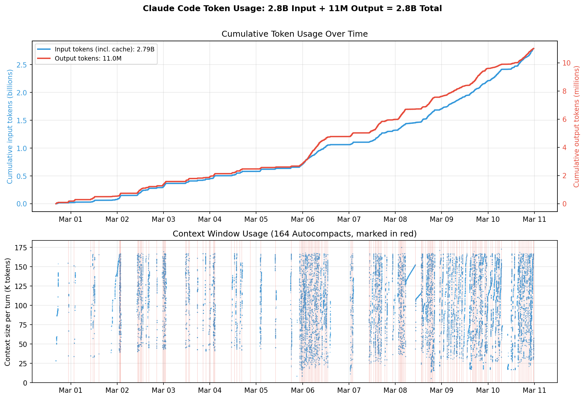
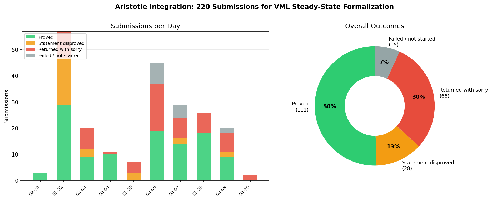
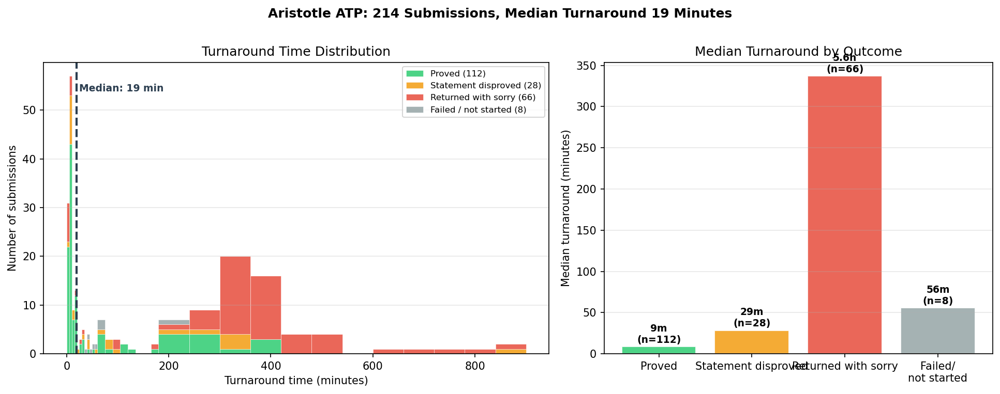
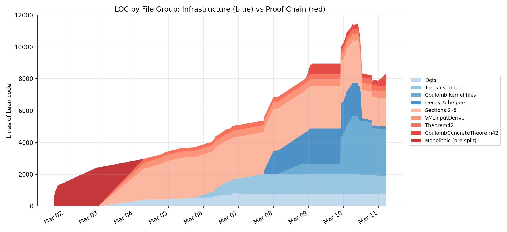
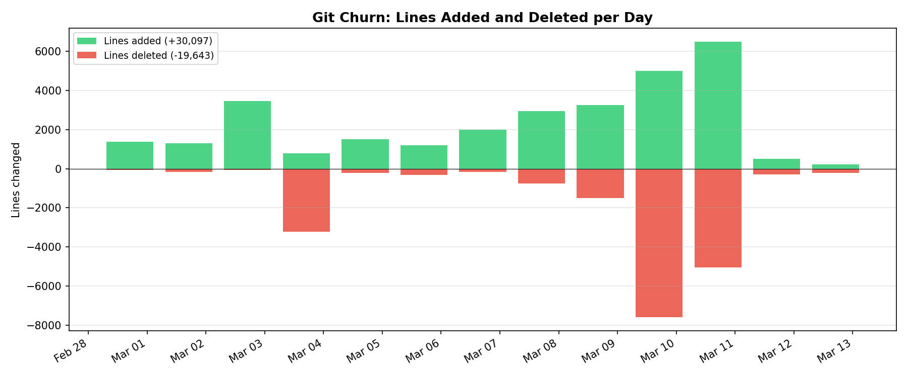
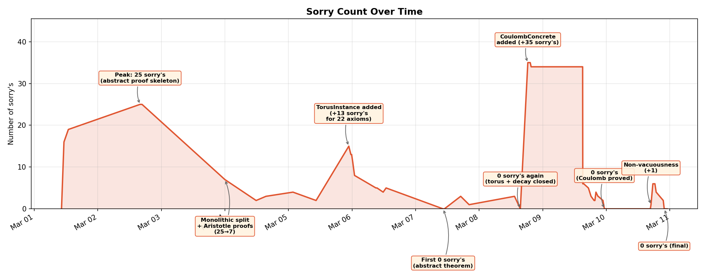
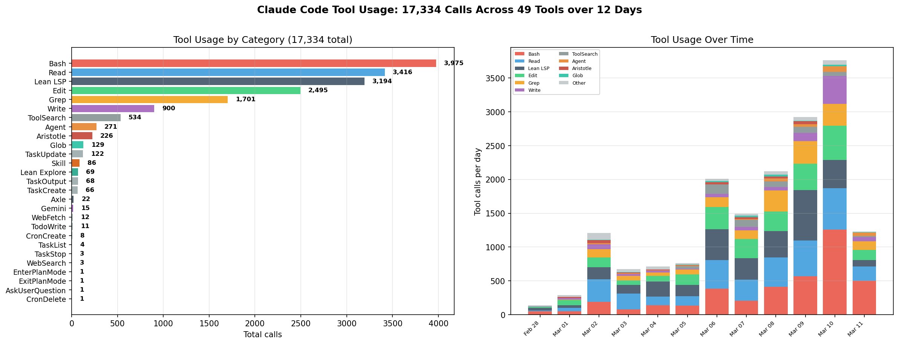

# Formal Verification of the Vlasov-Maxwell-Landau Steady-State Theorem

[](https://github.com/Vilin97/aristotle/actions/workflows/lean_action_ci.yml) [](https://vilin97.github.io/aristotle/blueprint/) [](https://vilin97.github.io/aristotle/blueprint/dep_graph_document.html)

A complete formalization of the characterization of smooth steady-state solutions to the **Vlasov-Maxwell-Landau (VML) system** with Coulomb collisions on the 3-torus.

**Status: fully verified by the Lean 4 kernel. 0 sorry's across 22 files (~8,300 lines).** [[Zulip discussion]](https://leanprover.zulipchat.com/#narrow/channel/219941-Machine-Learning-for-Theorem-Proving/topic/Discussion.3A.20Semi-autonomous.20formalization.20of.20VML.20equilibrium)

## Contents

- [The Mathematics](#the-mathematics) — [Physical System](#the-physical-system) | [Main Theorem](#the-main-theorem) | [Hypotheses](#hypotheses) | [Proof Architecture](#proof-architecture)
- [Development Process](#development-process) — [Narrative](#narrative) | [Session Activity](#session-activity) | [Token Usage](#token-usage) | [Babysit Loop](#the-babysit-loop) | [Aristotle Integration](#aristotle-integration) | [LOC Over Time](#lines-of-code-over-time) | [Git Churn](#git-churn) | [Sorry Elimination](#sorry-elimination) | [Tool Usage](#tool-usage)
- [Technical Stack](#technical-stack)

| Metric | Value |
|--------|-------|
| Lean 4 files | 22 |
| Lines of code | 8,297 |
| Theorems | 38 |
| Lemmas | 154 |
| Definitions | 28 |
| Sorry's | 0 |
| Development period | 10 days (Mar 1–10, 2026) |
| Git commits | 85 |
| Claude Code sessions | 32 (across 2 machines) |
| Interactive human prompts | 836 |
| `/babysit` invocations | 161 |
| Assistant turns | 27,200+ |
| Tool calls | 17,334 |
| Tokens consumed | 2.8 billion |
| Estimated API cost | ~$6,300 |
| Aristotle ATP submissions | 220 (111 proved, 28 disproved) |

[Documentation](https://vilin97.github.io/aristotle/blueprint/) | [Dependency graph](https://vilin97.github.io/aristotle/blueprint/dep_graph_document.html)


**Proof dependency graph.** All nodes are green (fully proved). The graph flows from primitive definitions (`normSq`, `eucNorm`, `landauMatrix`) at the top through intermediate results (`H_theorem`, `D_zero_implies_maxwellian`, the field and conservation lemmas) down to `theorem42` and its concrete Coulomb instantiation `coulomb_concrete` at the bottom. The interactive version is available [here](https://vilin97.github.io/aristotle/blueprint/dep_graph_document.html).

## The Mathematics

### The Physical System

*Disclaimer: This formalization studies the classic non-relativistic Vlasov-Maxwell-Landau system, where the velocity domain is the entire $\mathbb{R}^3$. While mathematically standard in kinetic theory literature for studying entropy methods, this formulation formally admits superluminal particle velocities ($|v| > c$). A strictly rigorous physical model would require the relativistic formulation replacing $v$ with momentum $p$.*

The Vlasov-Maxwell-Landau system models the dynamics of a charged plasma. The unknowns are:
- **f(x, v)**: the particle distribution function (density of particles at position x with velocity v)
- **E(x)**: the electric field
- **B(x)**: the magnetic field

The equations couple the Vlasov kinetic equation (particle transport under electromagnetic forces and collisions) with Maxwell's equations (electromagnetic field evolution):

```
v · ∇ₓf + (E + v × B) · ∇ᵥf = ν · Q(f, f)     (Vlasov)
curl B = J = ∫ v f dv                             (Ampere)
div E = ∫ f dv - ρ_ion                            (Gauss)
div B = 0                                          (Solenoidal)
```

The **Landau collision operator** Q(f, f) models binary Coulomb collisions:

```
Q(f, f)(v) = ∇ᵥ · ∫ A(v - w) [f(w)∇ᵥf(v) - f(v)∇ᵥf(w)] dw
```

where **A(z) = Ψ(|z|)(|z|²I - zz^T)** is the Landau collision matrix with the Coulomb kernel **Ψ(r) = r⁻³**.

### The Main Theorem

> **Theorem ([CoulombConcreteTheorem42](Aristotle/Landau/main/CoulombConcreteTheorem42.lean#L46)).** Let f > 0 be a smooth steady-state solution of the VML system with Coulomb collisions on T³ = (R/Z)³, with Schwartz-class velocity decay and a stretched-exponential lower bound. Then:
>
> 1. **f is a spatially uniform Maxwellian:** f(x, v) = ρ_ion / (2πT)^(3/2) · exp(-|v|² / 2T) for some T > 0
> 2. **The electric field vanishes:** E(x) = 0 everywhere
> 3. **The magnetic field is constant:** B(x) = B₀ for some constant B₀

In other words: the only smooth positive steady states are global thermodynamic equilibria. This is a rigidity result fundamental to plasma confinement theory.

### Hypotheses

The formal theorem takes 13 hypotheses:

| # | Hypothesis | Description |
|---|-----------|-------------|
| 1 | `hν` | Collision frequency ν > 0 |
| 2 | `hρ_ion` | Ion background density ρ_ion > 0 |
| 3 | `hf_pos` | Strict positivity: f(x, v) > 0 for all x, v |
| 4 | `hf_smooth_v` | f is C³ in velocity |
| 5 | `hf_smooth_x` | f is C² in space (via periodic lift) |
| 6 | `hB_smooth` | B is C² in space |
| 7 | `hSchwartz` | Schwartz decay in v: \|D^k f(x,v)\| · (1+\|v\|)^N ≤ C for all N, k |
| 8 | `hExpDecay` | Stretched-exponential lower bound: f ≥ exp(-C(1+\|v\|)^K) |
| 9 | `hGradBound` | Polynomial score bound: \|∂f/∂vᵢ\| ≤ Cg(1+\|v\|)^Kg · f |
| 10 | `hVlasov` | Steady-state Vlasov equation |
| 11 | `hAmpere` | Ampere's law |
| 12 | `hGauss` | Gauss's law |
| 13 | `hDivB` | Divergence-free magnetic field |

### Proof Architecture

The proof decomposes into 7 mathematically distinct steps, following a classical entropy method:

```
Section 2: Landau matrix A(z) is positive semi-definite
    ↓
Section 3: H-theorem → entropy dissipation D(f) ≤ 0
    ↓ D = 0 ⟹ f is Maxwellian (nullspace characterization)
Section 4: Vlasov transport → f is a LOCAL Maxwellian at each x
    ↓
Section 5: Polynomial matching → temperature T is constant
    ↓
Section 6: Killing's equation → bulk velocity u is constant
    ↓
Section 7: Maximum principle → u = 0 and E = 0
    ↓
Section 8: Harmonic analysis on T³ → B is constant
```

**Key mathematical insight (Coulomb singularity cancellation):** The Coulomb kernel Ψ(r) = r⁻³ is singular at r = 0, making the collision matrix A(z) diverge. However, the PSD integrand — which controls entropy dissipation — remains continuous because the score difference cancels the singularity:

```
|∇log f(v) - ∇log f(w)| = O(|v - w|)  cancels  Ψ(|v-w|) = O(|v-w|⁻³)
```

yielding a PSD integrand of order O(|v-w|), which vanishes on the diagonal.

## Development Process

This formalization was developed by a human mathematician ([Vasily Ilin](https://github.com/Vilin97)) working collaboratively with [Claude Code](https://docs.anthropic.com/en/docs/claude-code) (Anthropic's AI coding agent) and [Aristotle](https://aristotle.harmonic.fun/) (Harmonic's automated theorem prover).

### Narrative

The project began on the evening of February 28, 2026 (PDT). The initial prompt was:

> *"Look at H-theorem-formal.tex. I want to formalize that the steady state of the VML."*

The mathematical proof itself was [generated by Gemini DeepThink](https://gemini.google.com/share/0f27294c9ce6) and verified by hand before formalization began. After setting up Mathlib and the toolchain, the first Lean code was committed on March 1 as a single monolithic file (`landau-steady-state.lean`) stating the full theorem chain from the paper. Within hours the file exceeded a thousand lines, with `sorry`'s marking every gap. Claude estimated the formalization would require "multiple months." The project was completed in 11 days.

**Hypothesis discipline.** The most persistent methodological issue was controlling hypothesis creep. Claude's default behavior when encountering a hard lemma was to assume it as a hypothesis of the main theorem rather than prove it. The mathematician rejected this pattern throughout:

> *"You keep doing the same thing — adding hypotheses that are actually lemmas to be proven! Why do you do that? I keep telling you not to, and I wrote it in CLAUDE.md, but you keep doing it."* (Mar 2)
>
> *"I have told you time and again to keep the hypotheses to Theorem42 minimal. If you need a mathematical fact, it should be a lemma with a sorry, not a hypothesis!"* (Mar 3)

This principle was codified in the project's `CLAUDE.md`: *"The goal is not to end up with 0 sorry's! The goal is to make an honest formalization of the main theorem, with only the genuinely needed mathematical/physical assumptions."* A `sorry` — an acknowledged gap — was considered preferable to an unnecessary hypothesis, which silently weakens the theorem statement.

By March 4, an audit revealed that Theorem42 had accumulated **42 hypotheses**, including analytical regularity and integrability conditions that should have been derived rather than assumed. These were systematically reduced: velocity-space decay conditions were bundled into a single `VelocityDecayConditions` structure (replacing 15 scattered hypotheses), and regularity facts like continuity of the density ρ were derived inside the proof from domination bounds. The final concrete theorem has 13 hypotheses, all physically meaningful.

**Aristotle integration.** On March 1, the mathematician shared [Kim Morrison's Zulip post](https://leanprover.zulipchat.com/) describing a pipeline where Claude sends lemma statements to [Aristotle](https://aristotle.harmonic.fun/) for automated proving:

> *"Somehow they got Claude to call Aristotle programmatically. Maybe we can do something similar here?"*

This established the core workflow: decompose the proof into lemmas, submit each to Aristotle, check results, and iterate. The instruction was explicit: *"Don't be scared by the difficulty — if the lemma is true, there is a good chance Aristotle can prove it even if it's hard. And if it doesn't prove it, decompose it into smaller pieces, and have Aristotle prove those."* (Mar 2)

Aristotle's negation results were particularly valuable. When Aristotle proved the negation of a submitted lemma, it indicated a bug in the statement — typically a missing measurability hypothesis or a claim that fails on pathological counterexamples (e.g., a Vitali set). The fix-and-resubmit cycle (*"The lemmas that Aristotle negated — fix them and rerun Aristotle"*) served as the primary mechanism for catching false conjectures.

Over the project, 220 jobs were submitted: 111 proved (50%), 28 disproved (13%), 66 returned with `sorry` (30%), 15 failed (7%). Key Aristotle-proved results include `inv_norm_local_integrable`, `single_summand_deriv_bound`, `fubini_symmetrization_logf`, `ibp_real_line`, and `lorentz_force_div_zero`.

**Abstract/concrete split (Mar 2–4).** An early design decision was to separate the proof into an abstract framework and a concrete instantiation. The `FlatTorus3` typeclass specifies what the proof requires of the spatial domain — integration by parts, curl and divergence identities, a maximum principle, constancy of harmonic functions — without fixing it to a particular manifold. The mathematical argument (Sections 2–9 of the paper) was formalized against this interface, while a separate `TorusInstance` module proves that T³ = (ℝ/ℤ)³ satisfies all 22 fields. This separation ensured that when the torus proofs required rewrites (e.g., removing the false hypothesis `hDiff_velocityIntegral`), the abstract proof chain was unaffected.

On March 3, the monolithic file was split into the `main/` directory structure. The first batch of Aristotle submissions dropped the sorry count from 25 to 7 overnight.

**Spatial domain representation (Mar 2–5).** The choice of spatial domain representation was the project's longest-running design question. The theorem concerns functions on a 3-torus T³, but the Lean representation was not obvious. The initial approach used a fully abstract `FlatTorus3` typeclass. The mathematician was concerned about the resulting axiom count from the start: *"Can we now honestly instantiate the structure? And what are those 7 axioms?"* (Mar 2). *"Isn't T³ = S¹ × S¹ × S¹? What's the issue of instantiating it?"*

On March 5, several concrete representations were explored: the unit cube [0,1]³ ⊂ ℝ³ with periodic boundary conditions, a smooth manifold structure via Mathlib, and Mathlib's `AddCircle`:

> *"How big of an undertaking to add a smooth manifold structure? Make a new file outside of main/ and experiment with various ways to represent our spatial domain."* (Mar 5)
>
> *"I want the torus to be concrete. Let's go with the best long-term option. BUT let's first make sure it fits our needs."* (Mar 5)

A central concern was how to handle periodicity: *"What about the periodicity of all functions, will it be an assumption in every lemma? Seems awkward. Any way to package it with the torus itself? I mean, on a real torus every function is periodic."* The chosen representation — `Fin 3 → AddCircle 1` with `IsSpatiallyDiff f` defined as `ContDiff ℝ ⊤ (periodicLift f)` — resolves this: functions on the torus factor through the quotient map ℝ → ℝ/ℤ, so periodicity is automatic. The choice was validated by consulting Gemini (Google DeepMind's model, via MCP). The `TorusInstance` added 22 `sorry`'s — one per field of `FlatTorus3` — ranging from straightforward (`hGradConst`) to hard (`torus_hHarmonic_const`, proved via the energy method ∫|∇φ|² = −∫φΔφ = 0). All were closed by March 7, when the abstract theorem first reached **0 sorry's**.

**Automation (Mar 7–8).** On March 7, an adversarial self-review process was introduced. Claude was instructed to critique the formalization as a hostile reviewer: *"You are a hostile reviewer trying to REJECT this formalization. Your job is to find every weakness, gap, and dishonesty."* The output, `critique.md`, identified false hypotheses, unnecessary assumptions, and dead code.

Before boarding a flight on the evening of March 7, the mathematician submitted remaining lemmas to Aristotle (*"If there are any lemmas left, submit them to Aristotle now. I am boarding a plane"*, Mar 7, 20:29). On March 8 at 1 AM, upon landing, the automation suite was created in a 20-minute session (01:09–01:30). Four slash commands (`/critique`, `/prove`, `/check-aristotle`, `/cleanup`) were combined into `/babysit` and set to run on a 10-minute timer:

> *"Now we have /critique, /prove, /check-aristotle, and /cleanup. I want to run these commands in a loop until there are no issues in /critique."* (Mar 8, 01:13)

The first `/babysit` invocation ran at 01:19 AM on March 8. The loop eventually executed 72 documented cycles over the following two days, each cycle critiquing the codebase, planning work, proving theorems, submitting hard lemmas to Aristotle, and logging results.

**Coulomb kernel (Mar 8–9).** With the abstract theorem proved, the next step was instantiating it for the physical Coulomb kernel Ψ(r) = r⁻³. This required proving that the Landau collision operator with this singular kernel satisfies all 17 integrability, differentiability, and continuity conditions in the `VelocityDecayConditions` bundle. The `CoulombConcreteTheorem42.lean` file was created on the evening of March 8 with **35 sorry's**.

The Coulomb singularity at r = 0 makes |A_{ij}(z)| ~ ‖z‖⁻¹, which is just barely integrable in ℝ³. Each integrability proof required decomposing the domain into a ball around the origin (handled by local integrability of ‖z‖⁻¹) and the complement (handled by Schwartz decay). Key results such as `inv_norm_local_integrable` and `convolution_local_int_schwartz` were proved by Aristotle; others, such as `landau_flux_component_diff_with_bound`, required 800K heartbeats and the Leibniz integral rule (`hasFDerivAt_integral_of_dominated_of_fderiv_le`).

A university server was brought online on March 8 to run babysit loops concurrently with the local machine, enabling near-continuous progress. The session activity heatmap shows both machines running simultaneously on March 9–10.

**Sprint to zero (Mar 9).** On March 9, the sorry count in the Coulomb theorem dropped from 35 → 6 (file splitting + Aristotle results) → 0. The last sorry was closed at 11:15 PM — commit `20d0f4b`: *"Achieve 0 sorry's: prove differentiability + fix false Schwartz decay lemma."*

**Cleanup and non-vacuousness (Mar 10).** With 0 sorry's achieved, the babysit loop shifted to code quality: removing dead code (−3K lines), eliminating unnecessary `maxHeartbeats` overrides, and re-enabling linters. A separate theorem `CoulombConcreteTheorem42_nonvacuous` was added to verify that the hypotheses are satisfiable — the equilibrium Maxwellian with E = 0, B = 0 witnesses all 13 conditions. This briefly reintroduced sorry's (peaking at 6), all closed by the evening of March 10. Final state: **0 sorry's, 22 files, ~8,300 lines**.

The `/babysit` loop was iteratively refined throughout the project. Early versions were permissive; later iterations were rewritten to enforce strict execution of all steps and to drive work from `critique.md` rather than ad hoc priorities.

All 229 interactive human prompts (with timestamps, excluding bare slash commands like `/babysit`) are archived in [`artifacts/human_prompts.txt`](artifacts/human_prompts.txt).

### Session Activity


**Figure: Claude Code activity across two machines (local + university server).** Top: messages per hour, split into interactive human prompts (red), automated slash commands like `/babysit` (orange), and assistant turns (blue). Bottom: hour-of-day heatmap. Of 1,207 total human messages, **835 were interactive** (the mathematician directing the proof), **210 were automated** (161 `/babysit` invocations plus `/compact`, `/clear`, etc.), and 162 were context continuations. These generated **27,186 assistant turns** — a 26:1 ratio reflecting the high autonomy of each `/babysit` cycle (typically 20–50 tool calls per invocation). The heatmap shows near-round-the-clock activity on Mar 9–10 when both machines ran babysit loops concurrently, and overnight automated sessions (dark spots at 00:00–06:00) where the loop ran unattended.

### Token Usage



**Figure: Token consumption across the project.** Top: cumulative input tokens (blue, left axis, billions) and output tokens (red, right axis, millions). The project consumed **2.8 billion input tokens** (dominated by cache reads of the Lean 4 codebase and Mathlib context) and **11 million output tokens** (code generation, proof tactics, tool calls). The 254:1 input-to-output ratio reflects the read-heavy nature of formal verification — Claude reads far more context than it writes. Bottom: per-turn context size, showing a sawtooth pattern as the context window fills to ~175K tokens and resets at each of the **164 autocompacts** (red vertical lines). The dense compaction clusters on Mar 6–10 correspond to the intensive Coulomb kernel analysis and `/babysit` loop periods.

At Opus 4 API pricing, this usage would cost approximately **$6,300**: $4,071 in cache reads ($1.50/M), $1,401 in cache creation ($18.75/M), $826 in output ($75/M), and $6 in fresh input ($15/M). Without prompt caching, the same workload would cost ~$42,700 — caching saves 85%.

### The `/babysit` Loop

Development was organized around an automated **babysit cycle** — a repeating loop of:

1. **`/critique`** — adversarial review of the codebase, identifying sorry's, dead code, documentation drift, and architectural issues
2. **`/plan`** — prioritize work items based on the critique
3. **`/prove`** — hands-on theorem proving: close sorry's, fix proofs, write new lemmas
4. **`/simplify`** — refactor proofs, eliminate unnecessary heartbeat overrides, remove dead code
5. **`/submit-aristotle`** — extract hard lemmas and submit to Aristotle for automated proving
6. **`/check-aristotle`** — poll for completed Aristotle jobs and integrate solutions
7. **`/log`** — record what was accomplished in `LOG.md`

This loop ran for **72 documented cycles** over the course of the project. The development log (`Aristotle/Landau/LOG.md`) records every cycle.

### Aristotle Integration

[Aristotle](https://aristotle.harmonic.fun/) is Harmonic's cloud-based automated theorem prover for Lean 4. It was used for lemmas that were:
- Tedious to prove by hand (e.g., `lorentz_component_bound`)
- Required sophisticated integration arguments (e.g., `landau_flux_integrable_coulomb`, `psd_continuous_coulomb`)
- Needed counterexample construction (e.g., negated `force_entropy_integrable` via Vitali set)

Over the project, **220 jobs** were submitted to Aristotle:
- **111 lemmas proved** cleanly by Aristotle (50%)
- **28 statements disproved** — Aristotle found counterexamples or proved the negation (13%)
- **66 returned with sorry** — partial progress but incomplete (30%)
- **15 failed** or were not started (7%)



**Figure: Outcomes of 220 Aristotle submissions (data from API).** Aristotle proved 111 lemmas cleanly (50%), disproved 28 false statements (13%), returned 66 with sorry's still present (30%), and 15 failed or were never started (7%). The disproved statements were particularly valuable — they caught false conjectures early (e.g., Schwartz decay of Coulomb convolution derivatives, which actually have only O(‖v‖⁻²) decay). The stacked bar chart shows peak submission activity on Mar 2 (57 jobs) and Mar 6 (45 jobs). The high "returned with sorry" rate reflects the difficulty of the integrability estimates: many required domain-specific techniques (singularity cancellation, Leibniz integral rule) that exceeded Aristotle's current capabilities.

Key Aristotle-proved results include:
- `inv_norm_local_integrable`: ‖z‖⁻¹ is locally integrable in R³
- `convolution_local_int_schwartz`: convolution of ‖·‖⁻¹ with a Schwartz function is integrable
- `psd_continuous_coulomb`: the PSD integrand is continuous despite the Coulomb singularity
- `landau_flux_integrable_coulomb`: the Landau flux is integrable for Coulomb



**Figure: Aristotle turnaround times for 214 Landau-related submissions, colored by outcome.** Left: histogram of turnaround times. Proved lemmas (green) cluster in the first few bins (median **9 minutes**), while "returned with sorry" (red) dominates the long tail. The overall median was **19 minutes**. Right: median turnaround by outcome category. Successfully proved lemmas are fast (9 min); disproved statements take moderately longer (29 min, as Aristotle must construct a counterexample); but submissions returned with sorry take a median of **5.6 hours** — Aristotle exhausts its time budget searching before giving up. Failed submissions (56 min median) terminate earlier on infrastructure errors.

### Lines of Code Over Time


**Figure: Lean lines of code in `Aristotle/Landau/` across all 83 commits.** The project progressed in four phases. (1) **Abstract proof chain** (Mar 3–6): the mathematical argument (Sections 2–8) was formalized against an abstract `FlatTorus3` typeclass, and all 22 axioms were validated on the concrete torus T³ = (ℝ/ℤ)³. (2) **Coulomb kernel analysis** (Mar 7–9): the sharp LOC increase reflects the hard analytical work — proving integrability, differentiability, and continuity of the Landau collision operator for the Coulomb kernel Ψ(r) = r⁻³, which required handling the singularity at r = 0. This phase produced ~6K lines across `VelocityDecayInstance`, `CoulombFlux`, `CoulombPSD`, `CoulombFluxDiff`, and `CoulombConcreteTheorem42`, closing all 16 sorry's in the concrete theorem with help from [Aristotle](https://aristotle.harmonic.fun/). (3) **Cleanup** (Mar 10, early): 30+ commits systematically removed ~3K lines of dead code, redundant lemmas, unnecessary heartbeat overrides, and linter suppressions. (4) **Non-vacuousness** (Mar 10, late): a separate theorem proving that the hypotheses are satisfiable (the equilibrium Maxwellian with E = 0, B = 0 witnesses all 13 conditions). Generated by `scripts/loc_history.py`.



**Figure: LOC by file group over time.** Red shades are the mathematical proof chain (Sections 2–8, Theorem42, VMLInputDerive, CoulombConcreteTheorem42); blue shades are supporting infrastructure (definitions, torus instance, Coulomb kernel integrability files, decay helpers). The sharp blue growth on Mar 7–8 is the Coulomb kernel analysis: proving that the Landau collision operator with Ψ(r) = r⁻³ satisfies all 19 integrability, differentiability, and continuity conditions required by the abstract proof. This was the hardest part of the formalization — handling the singularity at r = 0 required ~4K lines of analytical estimates. The cleanup phase (Mar 10) primarily removed blue infrastructure code (redundant decay helpers, primed definitions, dead lemmas), while the red proof chain remained stable.

### Git Churn



**Figure: Lines of Lean code added and deleted per day.** Top: raw additions (green) and deletions (red). Bottom: net change. Most days are net-positive (new content being written), with two notable exceptions: **Mar 3** (the monolithic `landau-steady-state.lean` file was split into `main/` — same code reorganized, hence large add + delete with net negative), and **Mar 9–10** (the dead code cleanup phase removed ~3K lines of redundant lemmas, primed definitions, and unnecessary heartbeat overrides). Total over the project: +21,783 added, -13,478 deleted, net +8,305 lines.

### Sorry Elimination



**Figure: Number of `sorry`'s in `main/` over time (85 commits).** The sorry count follows a characteristic "sawtooth" pattern: sorry's accumulate as new proof scaffolding is written, then are eliminated through proving campaigns. Key events: (1) **Peak 25** (Mar 2): the abstract proof chain (Sections 2–9) stated with gaps. (2) **Monolithic split** (Mar 3–4): first wave of Aristotle proofs drops count from 25→7. (3) **TorusInstance** (Mar 5 evening): +13 sorry's for the 22 torus axioms, quickly resolved. (4) **First 0 sorry's** (Mar 7): the abstract theorem is fully proved — all sorry's in the main proof chain are closed. (5) **CoulombConcrete added** (Mar 8 evening): +35 sorry's for all Coulomb integrability/continuity conditions needed to instantiate the abstract theorem on the physical kernel Ψ(r) = r⁻³. (6) **Coulomb proved** (Mar 9 evening): 35→0 sprint via Aristotle submissions + manual proving. (7) **Non-vacuousness** (Mar 10): brief +1 from adding a satisfiability theorem, immediately resolved to **0 sorry's (final)**.

### Tool Usage



**Figure: Claude Code tool calls across 17,334 invocations over 12 days (Feb 28 – Mar 11).** Left: total calls by category. The core editing loop dominates — Bash (3,975), Read (3,416), Edit (2,495), Grep (1,701), Write (900) — reflecting the read-heavy, iterative nature of formal verification. Lean LSP tools (3,194 combined) provided real-time feedback: diagnostic messages (1,181), code execution (529), goal inspection (426), local search (353), and Mathlib search via LeanSearch (252) and Loogle (202). Aristotle submissions (226) represent lemmas extracted and sent to the cloud prover. Right: daily breakdown by tool category, showing the ramp-up from exploratory work (Feb 28 – Mar 2) through peak activity (Mar 6–10) when both machines ran `/babysit` loops concurrently, driving 2,000–3,500 tool calls per day.

## Technical Stack

| Component | Version |
|-----------|---------|
| Lean | 4.24.0 |
| Mathlib | v4.24.0 |
| Aristotle | [aristotle.harmonic.fun](https://aristotle.harmonic.fun/) |
| Claude Code | [claude.com/claude-code](https://claude.com/claude-code) |

## Authors

- [Vasily Ilin](https://github.com/Vilin97) (University of Washington) — project design, mathematical direction, hypothesis discipline, automation design
- [Claude Code](https://claude.com/claude-code) (Anthropic) — code generation, proof writing, codebase management
- [Aristotle](https://aristotle.harmonic.fun/) (Harmonic) — automated theorem proving (111 lemmas)

## License

This work is licensed under [CC BY-NC-SA 4.0](https://creativecommons.org/licenses/by-nc-sa/4.0/).

[](https://creativecommons.org/licenses/by-nc-sa/4.0/)
