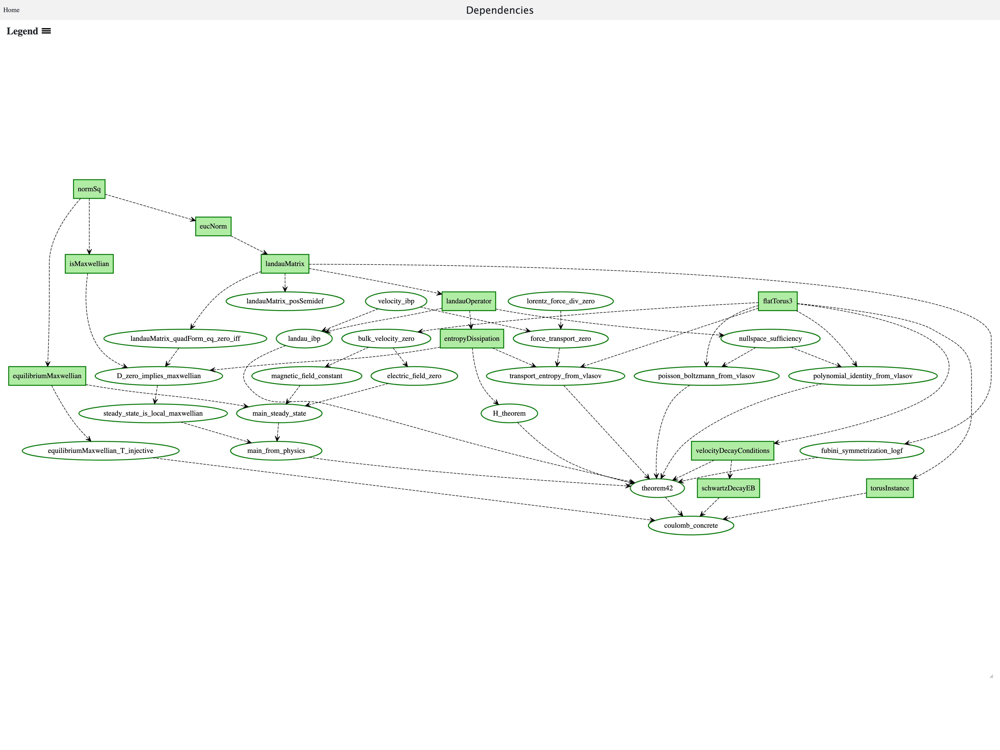
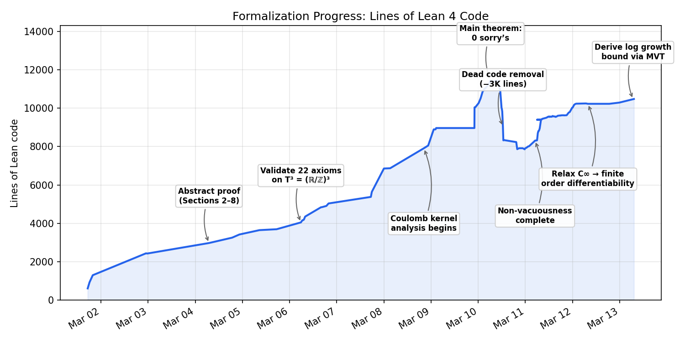
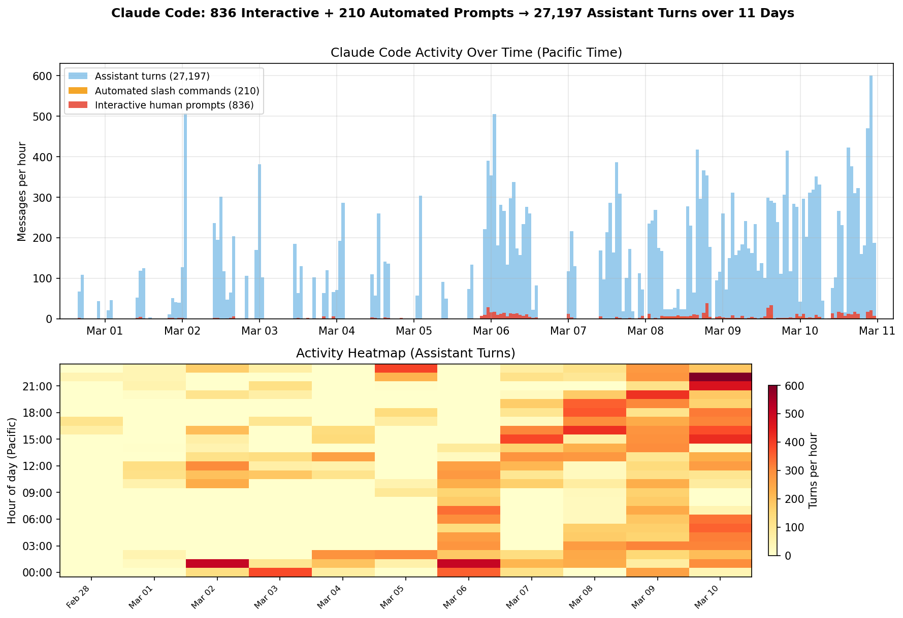

# Clawristotle: Semi-Autonomous Mathematical Research

  

    

> This README focuses on the autonomous agent system. For the detailed mathematical and technical report, see [TECHNICAL_REPORT.md](TECHNICAL_REPORT.md).

A complete formalization of the Vlasov-Maxwell-Landau steady-state theorem on the 3-torus — achieved in 10 days by a centaur team of AI agents and a human mathematician.

---

## 🚀 The Result

| Metric | Value |
|--------|-------|
| Status | ✅ Fully Verified (0 sorry's) |
| Lean 4 Code | 10,445 lines |
| Development Time | 10 days (Mar 1–10, 2026) |
| Human Prompts | 229 |
| Assistant Turns | 27,200+ |
| Tokens Consumed | 2.8 Billion |
| API Cost | ~$6,300 |

> *"The goal is not to end up with 0 sorry's! The goal is to make an honest formalization of the main theorem."* — [Project Manifesto](Aristotle/Landau/CLAUDE.md)

This project demonstrates a new paradigm in mathematical research: Semi-Autonomous Formalization. The human steers the high-level strategy and validates the definitions, while a suite of AI agents handles the implementation, proof search, and verification.

## 🤖 The Team

This result was produced by a specialized multi-agent system:

1. [Vasily Ilin](https://github.com/Vilin97) (Human): Architect & Reviewer. Designed the proof strategy, enforced hypothesis discipline, and audited critical definitions.
2. [Claude Code](https://claude.com/claude-code) (Agent): Engineer & Prover. Wrote 99% of the Lean code, managed the repository, and executed the `/babysit` loop.
3. [Gemini DeepThink](https://gemini.google.com) (Reasoning Model): Mathematician. Generated the initial natural-language proof and solved complex analytical bottlenecks.
4. [Aristotle](https://aristotle.harmonic.fun/) (ATP): Lemma Specialist. Automatically proved 111 difficult lemmas and caught 28 false conjectures via counterexample search.

## ⚡ The Engine: `/babysit`

The core innovation is the `/babysit` loop: an autonomous development cycle run by Claude Code.

1. `/critique`: Adversarial review of the codebase (finding gaps, dead code, weak definitions).
2. `/plan`: Prioritize work based on the critique.
3. `/prove`: Attempt to close open `sorry`'s using Mathlib tactics.
4. `/submit-aristotle`: Extract hard lemmas and send them to the Aristotle cloud prover.
5. `/check-aristotle`: Integrate successful proofs and debug failed ones.
6. `/simplify`: Refactor code and remove redundancy.

This loop ran continuously, often overnight, turning high-level directives into verified theorems.

## 📊 Visualization

### The Dependency Graph

*Every node represents a verified theorem. The graph flows from basic definitions to the final VML steady-state theorem.*

### Velocity of Development

*10,000 lines of verified code in 10 days. The sharp rise on Mar 7-8 represents the autonomous "sprint" to handle the Coulomb kernel singularity.*

### Autonomous Activity

*Blue bars are AI actions; red bars are human prompts. The system ran effectively autonomously for long stretches (see Mar 9-10).*

## 📚 The Mathematics

Theorem ([CoulombConcreteTheorem42](Aristotle/Landau/main/CoulombConcreteTheorem42.lean#L69)):
Let $f > 0$ be a smooth steady-state solution of the Vlasov-Maxwell-Landau system with Coulomb collisions on $\mathbb{T}^3$. If $f$ has appropriate decay and regularity, then:

1. $f$ is a global Maxwellian (thermodynamic equilibrium).
2. The electric field $E$ vanishes everywhere.
3. The magnetic field $B$ is constant.

This is a rigidity result fundamental to plasma physics, formalized here in full generality.

## 🛠️ Tech Stack

- Language: [Lean 4](https://leanprover.github.io/)
- Library: [Mathlib](https://github.com/leanprover-community/mathlib4)
- Agents: Claude Code, Gemini
- Prover: Aristotle (Harmonic)

## 📄 Resources

- [Technical Report](https://huggingface.co/papers/2603.15929)
- [Agent Logs Dataset](https://huggingface.co/datasets/Vilin97/Clawristotle-Logs)

## 📄 License

This work is licensed under [CC BY-NC-SA 4.0](https://creativecommons.org/licenses/by-nc-sa/4.0/).
