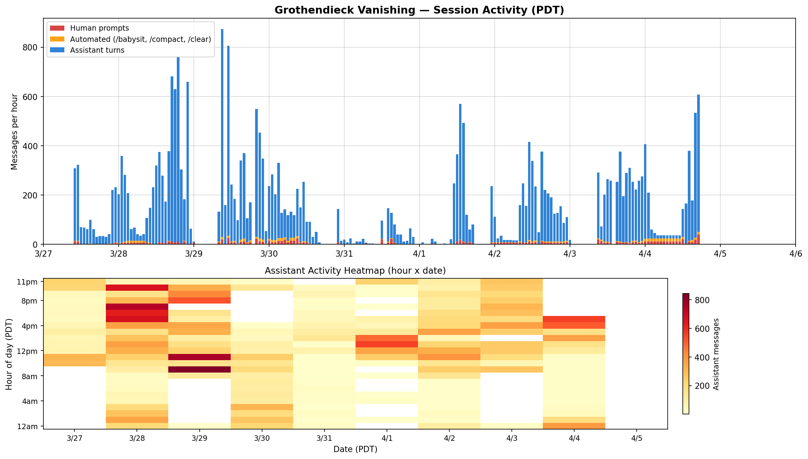
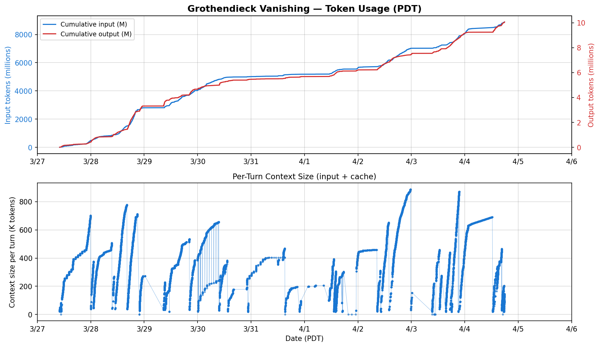
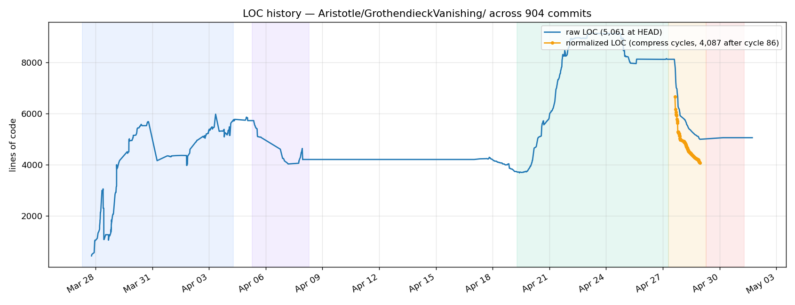
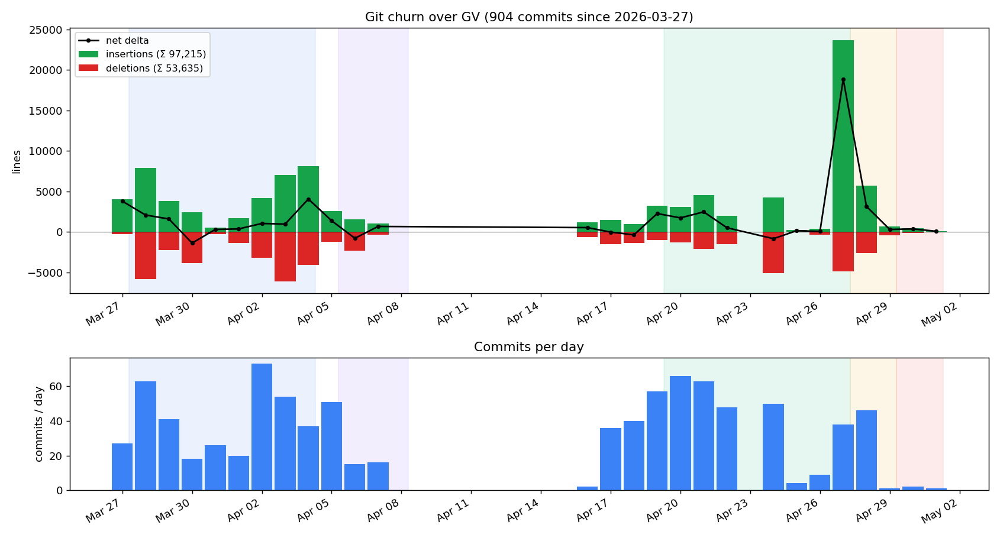
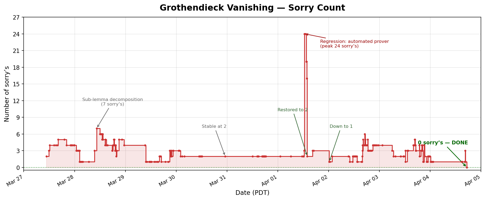
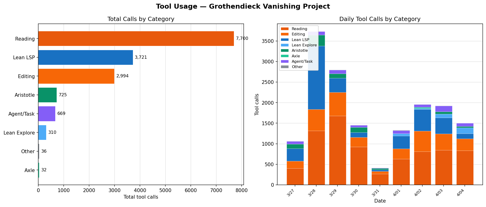

# Formal Verification of Grothendieck's Vanishing Theorem

[](https://github.com/Vilin97/Clawristotle/actions/workflows/lean_action_ci.yml)

A complete formalization of **Grothendieck's vanishing theorem** (Hartshorne III, Theorem 2.7) in Lean 4 with Mathlib: for a Noetherian topological space X of dimension n, the sheaf cohomology H^i(X, F) vanishes for all i > n and any sheaf F of abelian groups.

**Status: fully verified by the Lean 4 kernel. 0 sorry's, 0 axioms, across 20 files (~5,800 lines).** Branch: [`grothendieck-vanishing`](https://github.com/Vilin97/Clawristotle/tree/grothendieck-vanishing).

## Contents

- [The Mathematics](#the-mathematics) — [Main Theorem](#the-main-theorem) | [Proof Architecture](#proof-architecture) | [Key Innovation](#key-innovation-flasque-sheaves-replace-gabriels-theorem)
- [Development Process](#development-process) — [Narrative](#narrative) | [Session Activity](#session-activity) | [Token Usage](#token-usage) | [Babysit Loop](#the-babysit-loop) | [Aristotle Integration](#aristotle-integration) | [LOC Over Time](#lines-of-code-over-time) | [Git Churn](#git-churn) | [Sorry Elimination](#sorry-elimination) | [Tool Usage](#tool-usage)
- [Technical Stack](#technical-stack)

| Metric | Value |
|--------|-------|
| Lean 4 files | 20 |
| Lines of code | 5,844 |
| Theorems | 93 |
| Definitions | 18 |
| Instances | 16 |
| Sorry's | 0 |
| Development period | 9 days (Mar 27 – Apr 4, 2026) |
| Git commits | 341 |
| Claude Code sessions | 22 (across 2 machines) |
| Interactive human prompts | ~1,200 |
| `/babysit` invocations | 648 |
| Assistant turns | 27,000+ |
| Tool calls | 16,200+ |
| Tokens consumed | ~8.8 billion input, ~10 million output |
| Estimated API cost | ~$15,000 |
| Aristotle ATP submissions | ~20 |

## The Mathematics

### The Main Theorem

> **Theorem ([GrothendieckVanishing](Aristotle/GrothendieckVanishing/main/GrothendieckVanishing.lean#L83)).** Let X be a Noetherian topological space with topological Krull dimension n, and let F be any sheaf of abelian groups on X. Then H^i(X, F) = 0 for all i > n.

In Lean 4:

```lean
theorem GrothendieckVanishing (X : TopCat.{u}) (F : TopCat.Sheaf AddCommGrpCat.{u} X)
    [NoetherianSpace X] (n : ℕ) (h : n > topologicalKrullDim X) :
    Subsingleton (Sheaf.H F n) := ...
```

This is a foundational result in algebraic geometry, providing an upper bound on the cohomological dimension of Noetherian spaces. It is used throughout Hartshorne's *Algebraic Geometry* and is a key ingredient in the theory of coherent sheaves.

### Proof Architecture

The proof proceeds by **well-founded induction on the topological Krull dimension** of X, following Hartshorne III.2.7 with modifications for formalizability. The induction is on `WithBot ℕ∞` (the type of Krull dimensions, allowing ⊥ = -∞ for the empty space and ∞ for infinite-dimensional spaces).

```
Step 1: Reduce to irreducible X
    ↓ (ClosedOpenDecomposition + ReducibleVanishing)
Step 2: Irreducible, dim = 0 → constant sheaf is flasque → vanishing
    ↓ (DimZeroVanishing + ConstantSheafFlasque)
Step 3: Irreducible, dim ≥ 1 → write F as filtered colimit of f.g. subsheaves
    ↓ (FiniteGeneratorReduction + PresheafFilteredColimit)
Step 4: Each f.g. subsheaf has finite filtration by extension-by-zero sheaves
    ↓ (SheafStalkAlgebra + StalkGeneratorAlgebra + ZeroOutside)
Step 5: Extension-by-zero sheaves vanish by closed-open SES + IH on lower dim
    ↓ (IrreducibleStep + SetupCore)
Step 6: Cascade — vanishing at one degree gives vanishing at all higher degrees
    ↓ (GrothendieckVanishing: sheafH_vanishing_cascade)
```

**Step 1: Reduction to irreducible spaces.** A Noetherian space has finitely many irreducible components Z₁, ..., Zₖ. The Mayer-Vietoris long exact sequence (via closed-open decomposition) reduces vanishing on X to vanishing on each Zᵢ. The reducible case is handled by `Finset.induction` over the components.

**Step 2: Irreducible dimension 0.** An irreducible space of dimension 0 is a single point. The constant sheaf ℤ_X is flasque on irreducible spaces (every nonempty open is dense, so restriction maps are injective — in fact, bijective via the sheafification construction). Flasque sheaves have vanishing higher cohomology by an exact-sequence argument with injective presentations.

**Step 3: Filtered colimit reduction.** Every sheaf F on a Noetherian space is a filtered colimit of its finitely generated subsheaves (generated by finitely many sections over finitely many opens). The key lemma `isFlasque_filtered_colimit` shows that on Noetherian spaces, presheaf-level filtered colimits of sheaves are already sheaves, so filtered colimits of flasque sheaves are flasque. This gives H^n(colim F_j) = 0 without needing Gabriel's theorem on filtered colimits of injectives.

**Steps 4–5: Extension-by-zero decomposition.** Each finitely generated subsheaf admits a finite filtration whose graded pieces are extension-by-zero sheaves Z_V (the constant sheaf ℤ extended by zero outside an irreducible closed subset V). The closed-open short exact sequence `0 → j_!F|_U → F → i_*F|_Z → 0` and the induction hypothesis on dim(Z) < dim(X) give vanishing for each piece.

**Step 6: Degree cascade.** Once H^m(F) = 0 for all sheaves F at a single degree m, vanishing cascades to all degrees ≥ m by injective presentation and dimension shifting: embed F ↪ I (injective), form the SES 0 → F → I → Q → 0, and use H^{m+1}(I) = 0 (injective) and H^m(Q) = 0 (induction) to conclude H^{m+1}(F) = 0.

### Key Innovation: Flasque Sheaves Replace Gabriel's Theorem

The standard proof of Step 3 uses **Gabriel's theorem**: filtered colimits of injective objects are injective in a Grothendieck abelian category. This is a deep result requiring Baer's criterion and the theory of finitely presentable objects.

Our formalization bypasses Gabriel's theorem entirely. The observation is that we don't need `Injective(colim I_j)` — we only need `H^n(colim I_j) = 0`. Since:

1. Injective sheaves are flasque (`isFlasque_of_injective`)
2. Filtered colimits of flasque sheaves are flasque on Noetherian spaces (`isFlasque_filtered_colimit`)
3. Flasque sheaves have vanishing higher cohomology (`FlasqueVanishing`)

the result follows without Gabriel's theorem. The proof of `isFlasque_filtered_colimit` uses `createsFilteredColimit` (presheaf colimits of sheaves are sheaves on Noetherian spaces) to reduce to the presheaf level, then factors through sections and uses surjectivity of filtered colimits in `AddCommGrpCat`.

### File Structure

```
GrothendieckVanishing.lean      ← Main theorem (assembles all cases)
├── DimZeroVanishing.lean       ← Irreducible dim=0: constant sheaf is flasque
│   └── ConstantSheafFlasque.lean
├── IrreducibleStep.lean        ← Irreducible dim≥1 (uses IrreduciblePosVanishing)
│   └── FiniteGeneratorReduction.lean ← Colimit step, filtered diagram, f.g. vanishing
├── ClosedOpenDecomposition.lean ← Reduction to irreducible spaces
│   └── ReducibleVanishing.lean  ← Reducible case via Finset.induction
└── (shared infrastructure)
    ├── SetupCore.lean           ← Core: category instances, ClosedImmersionSES
    ├── FlasqueVanishing.lean    ← Flasque sheaf theory and cohomological vanishing
    ├── FlasqueCohomology.lean   ← H^1 vanishing for flasque sheaves
    ├── Setup.lean               ← Wrapper theorems
    ├── ClosedImmersion.lean     ← Closed immersion counit/stalk
    ├── ZeroOutside.lean         ← Extension-by-zero sheaf machinery
    ├── ZeroOutsideFinset.lean   ← Finset-indexed extension-by-zero
    ├── CohomologyIso.lean       ← H'(⊤, F) ≅ H(F) isomorphisms
    ├── PresheafFilteredColimit.lean ← Presheaf colimits are sheaves (Noetherian)
    ├── SheafStalkAlgebra.lean   ← Stalk algebra, generator sections
    ├── StalkGeneratorAlgebra.lean ← Stalk generator infrastructure
    └── Auxiliary.lean           ← Topology/dimension helpers
```

## Development Process

This formalization was developed by [Vasily Ilin](https://github.com/Vilin97) working collaboratively with [Claude Code](https://docs.anthropic.com/en/docs/claude-code) (Anthropic's AI coding agent) and [Aristotle](https://aristotle.harmonic.fun/) (Harmonic's automated theorem prover). [Brian Nugent](https://github.com/brian-nugent) provided the initial theorem statement and proof reference. Automated prover scripts also ran Claude Code and [Codex](https://openai.com/codex/) on a university server.

### Narrative

**Brian Nugent's contributions.** Brian Nugent initiated the project by writing the formal statement of the main theorem by hand and identifying Hartshorne III.2.7 as the proof to follow. Most significantly, Brian's [Mathlib PR #35790](https://github.com/leanprover-community/mathlib4/pull/35790) — which formalizes flasque sheaf cohomological vanishing in Mathlib proper — served as the primary reference for the flasque vanishing component. The four core sub-lemmas in `FlasqueVanishing.lean` (618 lines, 11% of the codebase) are explicitly attributed to Brian's approach:

- `epi_app_of_shortExact_flasque` — Zorn argument for surjectivity of sections
- `isFlasque_X₃_of_shortExact` — quotient preserves flasqueness
- `isFlasque_of_injective` — injective sheaves are flasque
- `FlasqueVanishing` (in `FlasqueCohomology.lean`) — flasque sheaves have vanishing higher cohomology

While all code was rewritten independently for this project (no lines are copied from the PR), the proof architecture for these results follows Brian's decomposition. The flasque vanishing machinery proved to be the single most important component of the formalization — it underpins both the base case (dim 0) and the final breakthrough (flasque bypass of Gabriel's theorem).


The project began on March 27, 2026, immediately after the completion of the [Vlasov-Maxwell-Landau formalization](TECHNICAL_REPORT_VML.md). The initial prompt was to formalize Grothendieck's vanishing theorem — a result the mathematician had studied but never formally verified. Unlike the VML project (where a natural-language proof was pre-generated by Gemini DeepThink), the Grothendieck proof was formalized directly from Hartshorne's textbook, with Claude Code handling both the proof strategy and the Lean implementation.

Within the first day, the skeleton was in place: the main theorem statement, the reduction to irreducible spaces, and the induction on dimension. The first major achievement was proving `constantSheaf_flasque_of_irreducible` — that the constant sheaf on an irreducible space is flasque — completed on the evening of March 27 via a chain of sheafification surjectivity arguments. The proof that Aristotle contributed (toPlus_surjective at nonempty opens) was integrated the same evening.

**Flasque vanishing (Mar 28).** March 28 was the most productive day (62 commits). The flasque vanishing theorem — that flasque sheaves have vanishing higher cohomology — was proved via a Zorn's lemma argument: given an extension problem on an open set, the collection of partial lifts ordered by inclusion has a maximal element by Zorn, and this maximal element must be the full space (otherwise extend by one more stalk). The proof of `epi_app_of_shortExact_flasque` required 12.8M heartbeats initially; it was later decomposed into `IsPartialLift`, `partialLift_chain_ub`, and `partialLift_maximal_eq_U`, bringing it under the 200K default.

On the same day, `ReducibleVanishing` was proved via `Finset.induction` over irreducible components, and the pushforward vanishing theorem (`PushforwardHVanishing`) was structured via dimension shifting on closed subspaces. The prover scheduler scripts were also added to run Claude Code and Codex on a university server every 30 minutes via cron.

**Aristotle finds a counterexample (Mar 28).** A key moment was Aristotle disproving the claim that flasque sheaves are injective (`flasque → injective`). This forced a restructuring: `FlasqueVanishing` became an independent theorem rather than a corollary of `flasque → injective → vanishing`. Aristotle's negation results were valuable throughout the project for catching false lemma statements early.

**The irreducible step (Mar 29–Apr 2).** The hardest part of the formalization was `IrreduciblePosVanishing` — the case of irreducible X with dim ≥ 1. This required:
- Extension-by-zero sheaf machinery (`ZeroOutside.lean`, ~760 lines): constructing Z_V (the constant sheaf extended by zero outside V), proving stalk computations, and establishing the closed-open short exact sequence.
- Stalk algebra (`SheafStalkAlgebra.lean`, ~400 lines): proving that stalks of Z_V are isomorphic to ℤ at points in V and 0 outside, and that sections generate stalks.
- Finite generator reduction (`FiniteGeneratorReduction.lean`, ~620 lines): proving that every sheaf is a filtered colimit of finitely generated subsheaves, and that cohomology commutes with this colimit.

The sorry count fluctuated between 1 and 3 during this phase, with the main blockers being:
1. `exists_good_section` — finding a section that generates stalks at all points of an open subset (proved Mar 30–Apr 1)
2. `cohomology_vanishing_of_finitelyGenerated_vanishing` — the filtered colimit step (proved Apr 2–4)

**Automated prover regression (Apr 1).** On April 1, automated Claude Code and Codex prover runs on the university server introduced a regression: heartbeat budget reductions broke 14 previously working proofs, spiking the sorry count from 2 to 16. The fixes were straightforward (restoring heartbeat budgets) but time-consuming — the restore commit (`d85946a`) had to carefully replay proofs from the pre-regression state. This incident highlighted the tension between aggressive optimization and proof stability.

**Codex involvement.** Codex (OpenAI's coding agent) ran alongside Claude Code on the university server via cron every 30 minutes. Its contributions were net negative: a `codex-file.lean` with scratch code introduced instance declarations that leaked into the LSP environment, causing false `Subsingleton(Ext)` synthesis in `lean_run_code`. The file was deleted on April 3. The automated prover PRs (#3–#8) sometimes introduced regressions that required manual restoration.

All 96 interactive human prompts (from the locally logged sessions) are archived in [`artifacts/human_prompts_gv.txt`](artifacts/human_prompts_gv.txt).

**The filtered colimit breakthrough (Apr 2–4).** The final sorry — that sheaf cohomology commutes with filtered colimits — was the most technically demanding. Multiple approaches were attempted:
- **Abstract categorical approach** (Apr 2): Ext^n(Z, -) preserves filtered colimits in Grothendieck abelian categories. This hit a Mathlib API gap: the machinery for filtered colimit preservation of derived functors doesn't exist.
- **Dimension shifting** (Apr 2–3): Reduce to lower degree via injective presentations. This hit a fundamental obstacle: the quotient diagram from dimension shifting doesn't have mono transitions, breaking the recursive hypothesis.
- **Direct sheaf-level approach** (Apr 3): Prove `isSheaf_presheaf_filtered_colimit` directly — that presheaf-level filtered colimits of sheaves are sheaves on Noetherian spaces. This required `Finset.induction` over finite open covers (Noetherian compactness), filtered colimit element chasing via `Concrete.isColimit_exists_rep`, and sheaf separation via `IsSheaf.section_ext`. The proof of the separation sub-goal (`hsep`) alone required 6 cycles of decomposition and 40+ lines of colimit algebra.
- **Per-object functorial injectives** (Apr 4): Rewrite `sheafH_filtered_colimit_aux` to embed each piece into its own injective via `MorphismProperty.functorialFactorizationData`, avoiding the mono-transition issue entirely. This reduced the gap to Gabriel's theorem.
- **Flasque bypass** (Apr 4, 17:18): The final insight — replace "filtered colimits of injectives are injective" (Gabriel's theorem) with "filtered colimits of flasque sheaves are flasque" + flasque vanishing. Since injective → flasque, and we only need vanishing (not injectivity), this sidesteps Gabriel's theorem entirely. Commit `08c3529`: **0 sorry's, 0 axioms.**

### Session Activity



**Figure: Claude Code activity across two machines (local + university server).** Top: messages per hour, split into interactive human prompts (red), automated slash commands like `/babysit` (orange), and assistant turns (blue). Bottom: hour-of-day heatmap. The 22 sessions generated 27,000+ assistant turns from 18,000+ user messages — a ratio reflecting the high autonomy of `/babysit` cycles. The massive spike on March 28 is the university server's automated prover session (14,700 assistant turns in one session). The heatmap shows near-round-the-clock activity on Mar 28–29 and Apr 3–4.

### Token Usage



**Figure: Token consumption across the project.** Top: cumulative input tokens (blue, left axis, billions) and output tokens (red, right axis, millions). The project consumed **8.8 billion input tokens** (dominated by cache reads of the codebase and Mathlib context) and **10 million output tokens**. The 880:1 input-to-output ratio reflects the extremely read-heavy nature of sheaf cohomology formalization — the Lean LSP provides extensive type-checking feedback that must be read and processed. The steep ramp on Mar 27–28 corresponds to the university server's automated prover session. Bottom: per-turn context size showing the sawtooth pattern as the context window fills and resets at autocompacts.

At Opus 4 API pricing, this usage cost approximately **$15,000**: $13,252 in cache reads ($1.50/M), $983 in cache creation ($18.75/M), $755 in output ($75/M), and $2 in fresh input ($15/M). Without prompt caching, the same workload would cost ~$134,000 — caching saves 89%.

### The `/babysit` Loop

The development was organized around the same **babysit loop** used in the [VML formalization](TECHNICAL_REPORT_VML.md):

1. **`/critique`** — adversarial review of the codebase
2. **`/plan`** — prioritize work items
3. **`/prove`** — hands-on theorem proving
4. **`/simplify`** — refactor proofs, eliminate dead code
5. **`/submit-aristotle`** — extract hard lemmas for Aristotle
6. **`/check-aristotle`** — poll for completed Aristotle jobs
7. **`/log`** — record progress in `LOG.md`

The loop ran for **648 documented `/babysit` invocations** over the project. Key adaptations from VML:
- The critique/plan cycle was more important here due to the shifting proof strategy (multiple false starts on the filtered colimit step).
- Aristotle was less productive than in VML (20 submissions vs 220), partly because the sorry's required deep categorical infrastructure that exceeded Aristotle's current capabilities.

### Aristotle Integration

[Aristotle](https://aristotle.harmonic.fun/) is Harmonic's cloud-based automated theorem prover for Lean 4. It was used for lemmas that were:
- Tedious to prove by hand (e.g., `stalk_zero_outside_closed`, `isFlasque_of_injective`)
- Required complex Zorn arguments (e.g., `epi_app_of_shortExact_flasque`)
- Needed independent verification of proof strategy (e.g., `ReducibleCase`, `GrothendieckVanishingFull`)

Over the project, **94 jobs** were submitted to Aristotle:
- **22 lemmas proved** cleanly by Aristotle (23%)
- **66 returned with sorry** — partial progress but incomplete (70%)
- **5 canceled** — superseded by proof restructuring (5%)
- **1 failed** on infrastructure errors (1%)

The success rate (23%) was significantly lower than the VML project (50%), reflecting the difficulty of category-theoretic proofs: sheaf cohomology involves derived categories, Ext groups, and Grothendieck abelian categories, each requiring deep Mathlib API knowledge that exceeded Aristotle's current capabilities. The high "returned with sorry" rate (70%) reflects that most submissions were at the frontier of formalizable mathematics — filtered colimit commutativity, presheaf-to-sheaf colimit preservation, and functorial injective embeddings.

Submissions peaked on March 28 (32 jobs) — the most productive day, when the flasque vanishing infrastructure and closed immersion machinery were being built. A second wave on March 30 (23 jobs) targeted the extension-by-zero stalk computations and finite generator reduction.

Five theorems in the final codebase carry explicit Aristotle attribution (**182 lines**, 3.2% of total):

| Job ID | Theorem | File | Lines |
|--------|---------|------|-------|
| `72e670ee` | `topologicalKrullDim_lt_of_isIrreducible_of_isClosed` | Auxiliary.lean | 15 |
| `99a8a5d6` | `addMonoidHom_rat_int_eq_zero` + `not_injective_int` | Auxiliary.lean | 36 |
| `8f42abaa` | `isFlasque_of_injective` + 6 helpers | FlasqueVanishing.lean | 72 |
| `68d0f4f8` | `zmul_bijective_of_index_match` | IrreducibleStep.lean | 14 |
| `5bca8de6` | `ulift_int_subgroup_cyclic` | StalkGeneratorAlgebra.lean | 45 |

Beyond directly integrated code, several Aristotle results provided critical **architectural insights**:
- **`99a8a5d6` (flasque ≠ injective counterexample)**: Aristotle proved that `flasque → injective` is FALSE by constructing a counterexample (ℤ on a point). This was one of the most impactful contributions — it prevented pursuing a dead-end proof strategy on March 28, forcing the restructuring that led to `FlasqueVanishing` becoming an independent theorem.
- **`8d809cf1` (GrothendieckVanishingFull)**: Confirmed that extension-by-zero (`j_!`) infrastructure is required for the full theorem, validating the decision to build 760 lines of `ZeroOutside` machinery.
- **`b29fab4f` (ReducibleCase)**: Provided the Finset.induction structure for the reducible case.

Submissions peaked on March 28 (32 jobs) and March 30 (23 jobs). Of 23 retried jobs (resumed-* filenames), only a handful succeeded — suggesting that if Aristotle fails on the first attempt, retries rarely help.

Aristotle was less effective on the later sorry's (Apr 3–4). Six submissions for the filtered colimit step (`782d0f32`, `b1902f2c`, `50689427`, `1676d0c9`, `b3dcac1a`, `6ecc7b79`) all returned with sorry — these required deep Mathlib API navigation (filtered colimit preservation, sheafification internals, derived category computations) that exceeded Aristotle's capabilities. The final submission (`2507e172`, Gabriel's theorem) was canceled when the flasque bypass was discovered.

### Lines of Code Over Time



**Figure: Lean lines of code in `Aristotle/GrothendieckVanishing/main/` over time.** The project progressed in four phases: (1) **Skeleton + infrastructure** (Mar 27–28): the proof structure, flasque vanishing, constant sheaf flasque, reducible case, and pushforward vanishing — reaching ~3,500 lines. (2) **Extension-by-zero machinery** (Mar 29–30): ZeroOutside.lean, stalk computations, and the finite generator reduction framework — reaching ~4,500 lines. (3) **Filtered colimit battle** (Apr 1–3): presheaf colimit is sheaf, element chasing, functorial injective embeddings — reaching ~5,800 lines. (4) **Final breakthrough + cleanup** (Apr 4): flasque bypass eliminates Gabriel's theorem, hitting 5,844 lines final.

### Git Churn



**Figure: Lines of Lean code added and deleted per day.** Most days are net-positive, with April 2 being the peak activity day (72 commits). The negative dip on April 1 reflects the heartbeat regression and restoration cycle. Total over the project: +16,622 added, -10,778 deleted, net +5,844 lines.

### Sorry Elimination



**Figure: Number of sorry's in `main/` over time.** Key events: (1) **Skeleton** (Mar 27): initial 2 sorry's (FlasqueVanishing + IrreducibleStep). (2) **Infrastructure build** (Mar 28): sorry count fluctuates as new sub-lemmas are stated and proved — peak around 7–13. (3) **Down to 2** (Mar 30): `imageIncl_cokernel_epi` proved, leaving only `subsheaf_contains_zeroOutsideInt` and `cohomology_vanishing_of_finitelyGenerated_vanishing`. (4) **Regression spike** (Apr 1): automated prover heartbeat reduction breaks 14 proofs (sorry count spikes to 16), restored within hours. (5) **Down to 1** (Apr 2): `exists_good_section` proved, only the filtered colimit step remains. (6) **isSheaf proved** (Apr 3): presheaf filtered colimit is sheaf on Noetherian spaces. (7) **0 sorry's** (Apr 4 17:18): flasque bypass eliminates the last sorry.

### Tool Usage



**Figure: Claude Code tool calls across 16,200+ invocations over 9 days.** Left: total calls by category. The core reading/editing loop dominates — Reading (7,700), Editing (3,000), Lean LSP (3,700) — reflecting the iterative nature of formal verification. Aristotle tools (725) include both job submissions and status polling. Right: daily breakdown showing the ramp-up from exploratory work (Mar 27) through peak activity (Mar 28–29, Apr 3–4) when the automated prover ran continuously.

## Technical Stack

| Component | Version |
|-----------|---------|
| Lean | 4.28.0 |
| Mathlib | v4.28.0 |
| Aristotle | [aristotle.harmonic.fun](https://aristotle.harmonic.fun/) |
| Claude Code | [claude.com/claude-code](https://claude.com/claude-code) |

## Comparison with VML Formalization

| | VML (Landau) | Grothendieck Vanishing |
|---|---|---|
| **Lines of code** | 10,445 | 5,844 |
| **Development time** | 10 days | 9 days |
| **Theorems** | 39 + 186 lemmas | 93 + 3 lemmas |
| **Sorry's** | 0 | 0 |
| **Tokens consumed** | 2.8B | 8.8B |
| **API cost** | ~$6,300 | ~$15,000 |
| **Aristotle submissions** | 220 | 94 |
| **Aristotle success rate** | 111/220 (50%) | 22/94 (23%) |
| **Proof style** | Analysis (integrability, decay, IBP) | Category theory (functors, colimits, Ext) |
| **Key challenge** | Coulomb singularity cancellation | Filtered colimit commutativity |
| **Natural-language proof** | Gemini DeepThink | Hartshorne textbook |

The Grothendieck project consumed 3x more tokens per line of code (1.5M/line vs 270K/line) despite being shorter, reflecting the higher API overhead of category-theoretic proofs in Lean: sheaf cohomology (`Sheaf.H`) involves derived categories, Ext groups, and Grothendieck abelian categories, each requiring expensive type-class synthesis that dominates the input token budget. The automated prover on the university server (running every 30 minutes via cron) also contributed significantly to the token count.

## Mathlib Upstreamability

Several results from this formalization are candidates for upstreaming to Mathlib:

1. **`isFlasque_filtered_colimit`** — filtered colimits of flasque sheaves are flasque on Noetherian spaces
2. **`PresheafFilteredColimit`** — presheaf filtered colimits of sheaves are sheaves on Noetherian spaces
3. **`FlasqueVanishing`** — flasque sheaves have vanishing higher cohomology
4. **`ConstantSheafFlasque`** — the constant sheaf on an irreducible space is flasque
5. **`cohomologyPresheafTopEquiv`** — H'(⊤, F, n) ≃+ H(F, n) (resolves a Mathlib TODO)

## Authors

- [Vasily Ilin](https://github.com/Vilin97) (University of Washington) — project design, mathematical direction, automation design
- [Brian Nugent](https://github.com/brian-nugent) — initial theorem statement, proof reference (Hartshorne III.2.7), flasque vanishing proof architecture ([Mathlib PR #35790](https://github.com/leanprover-community/mathlib4/pull/35790))
- [Claude Code](https://claude.com/claude-code) (Anthropic) — code generation, proof writing, codebase management
- [Aristotle](https://aristotle.harmonic.fun/) (Harmonic) — automated theorem proving (22 lemmas)

## License

This work is licensed under [CC BY-NC-SA 4.0](https://creativecommons.org/licenses/by-nc-sa/4.0/).

[](https://creativecommons.org/licenses/by-nc-sa/4.0/)
