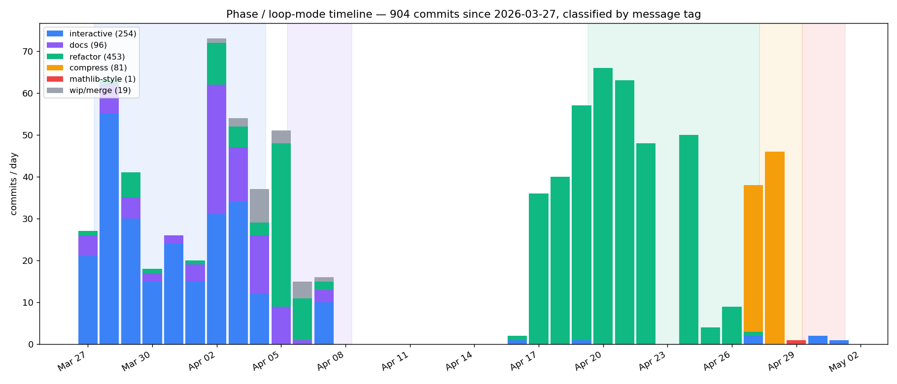
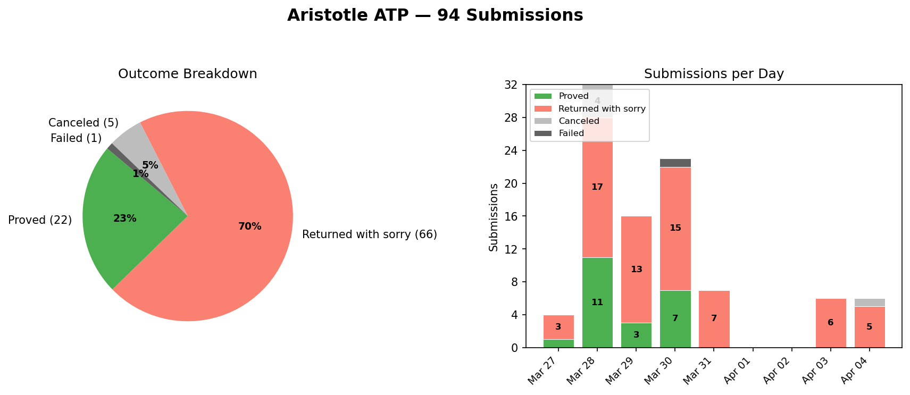
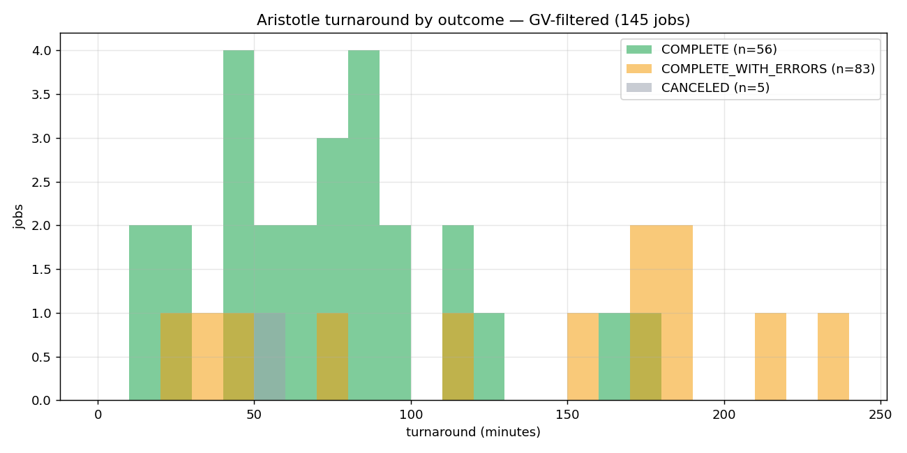
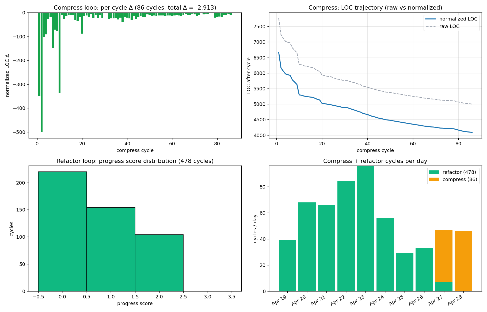
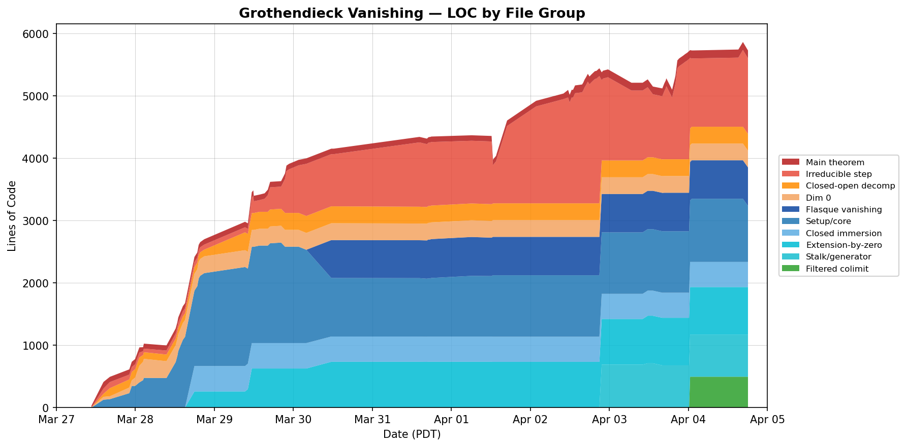

# Grothendieck's Vanishing Theorem: An AI-Driven Formalization Case Study

**Project:** Formalization of Hartshorne III, Theorem 2.7 in Lean 4 + Mathlib.
**Window:** 2026-03-27 → 2026-05-01 (35 elapsed days, 27 active).
**Repo:** `github.com/Vilin97/Clawristotle`, branch `wip/grothendieck-vanishing`
(merged via PR auto-merge into protected `grothendieck-vanishing`).
**Authors:** see §13.
**Status:** *draft technical report*. Awaiting Brian Nugent's review-2 to populate §11.

---

## 0. Abstract

This report is a clinical case study, not a triumph narrative.

We formalized Grothendieck's vanishing theorem (for any Noetherian topological
space `X` of dimension `n` and any sheaf `F` of abelian groups on `X`,
`Hⁱ(X, F) = 0` for all `i > n`) in Lean 4 + Mathlib in 9 active days, using a
minimal-agent toolkit: Claude Code (interactive + autonomous loops) +
`lean-lsp-mcp` + the Aristotle external prover (Harmonic AI). The proof closed
sorry-free with no axioms beyond `propext` / `Classical.choice` / `Quot.sound`
on 2026-04-04. After that, a human code review by Brian Nugent (Apr 8–15)
identified five "Large changes" plus dozens of per-file items; the response
ran for two weeks (Codex CLI refactor loop + Codex compress loop + a
mathlib-style cleanup PR), reducing normalized LOC by 42% (7,016 → 4,087)
and crossing a user-set raw <5,000 target on the very last cycle.

Headline numbers:

| Metric | Value |
|---|---|
| Theorem | Hartshorne III.2.7 — `H^n(X, F) = 0` for `n > dim X`, `X` Noetherian |
| Sorry / non-default axioms at HEAD | 0 / 0 |
| Lean files at HEAD | 15, raw 5,061 LOC, normalized 4,087 |
| Git commits since Mar 27 | 904 |
| Active days (commit-touched) | 27 of 35 elapsed |
| Claude Code | 31,529 turns / 270 sessions / 13.9M output tokens / 6.76B cache reads |
| Codex CLI | 5 persisted GV sessions (~26.4M tokens) + 564 ephemeral cycles (compress 86 + refactor 478) |
| Aristotle (Harmonic) | 94 proving-phase + 7 aristotle-loop submissions; 22 / 66 / 5 / 1 outcome split (`COMPLETE` / `…WITH_ERRORS` / `CANCELED` / `FAILED`) |
| Human reviews | Brian Nugent ×2 (Apr 8–15 = R1, May 1+ = R2 in progress) |

The thesis: *with a minimal-agent toolkit, a third-year algebraic-geometry
theorem can be formalized in five weeks, but the resulting code requires
substantial human review to reach idiomatic quality, and even after a
review-driven refactor, recognisable failure modes persist.* This document
catalogues those failure modes and quantifies, for one project, how much
code-quality improvement a single human review actually drove.

The intended audience is anyone building or evaluating an AI-driven
formalization workflow. We did not build a novel agent. We used an
off-the-shelf one and tried to honestly catalogue what broke.

---

## 1. The Mathematics

The theorem (Hartshorne III, Theorem 2.7):

> Let `X` be a Noetherian topological space of dimension `n`. For any sheaf
> `F` of abelian groups on `X` and any integer `i > n`, the sheaf cohomology
> group `Hⁱ(X, F)` vanishes.

In Lean (full statement extracted in `artifacts/lean-theorem-statement_gv.lean`):

```lean
theorem GrothendieckVanishing
    (X : TopCat.{u}) [TopologicalSpace.NoetherianSpace X]
    (n : ℕ) (h : n > topologicalKrullDim X)
    (F : TopCat.Sheaf AddCommGrpCat.{u} X) :
    Subsingleton (Sheaf.H F n)
```

`Sheaf.H` is defined via `Ext` in Mathlib's derived-category machinery; the
statement uses `Subsingleton` rather than `IsZero` because the derived
category constructions naturally produce typeclass-style emptiness rather
than a zero-object identification. (This choice is at the boundary of
idiomatic Mathlib style and is one of the things review-2 may flag.)

### Proof architecture (4 pillars)

The proof proceeds by well-founded induction on the topological Krull
dimension of `X`, with four architectural pillars:

1. **Reducible → irreducible reduction.** Any Noetherian space decomposes
   into finitely many irreducible components; cohomology of the whole splits
   along Mayer-Vietoris into cohomology of the components and their
   intersections (which have strictly smaller dimension), so the inductive
   hypothesis closes the reducible case.

2. **Closed immersion machinery.** For an irreducible space, we pick a closed
   subset `Z` and the open complement `U = X \ Z`. The associated short
   exact sequence `0 → j_! F|_U → F → i_* F|_Z → 0` (with `j_!` extension by
   zero from the open set, `i_*` pushforward from the closed set) plus the
   long exact sequence in cohomology reduces vanishing to vanishing on `Z`
   and `U`.

3. **Flasque vanishing.** The constant sheaf `Z_X` on an irreducible space
   is flasque (every restriction map is surjective). Flasque sheaves have
   vanishing higher cohomology. This handles the dim-0 base case and parts
   of higher dimensions.

4. **Finite-generator reduction via filtered colimits.** Any sheaf of
   abelian groups on a Noetherian space is the filtered colimit of its
   finitely-generated subsheaves; cohomology commutes with filtered colimits
   on Noetherian spaces. This reduces the general statement to vanishing
   on finitely-generated sheaves, which decompose further until we reach
   pieces handled by pillars 2 and 3.

The proof's headline architectural surprise is the **last sorry**: it was
closed not by proving the dreaded "filtered colimits of injectives are
injective," but by reframing — injectives are flasque, filtered colimits of
flasques are flasque, flasques have vanishing higher cohomology. The
hardest-looking sublemma was avoided. We return to this in §4.4.

The proof is conventional in mathematical content; what makes this project
worth reporting is *how* it was assembled, not what was proved.


**Figure: Lean import graph for `Aristotle/GrothendieckVanishing/main/`.** All
15 files at HEAD, with arrows pointing from importers to imports. The graph
reads bottom-up in dependency order: `TopologicalKrullDim.lean` and the
extension-by-zero / closed-immersion infrastructure feed into the
`FlasqueVanishing` and `ClosedImmersionCohomology` blocks; those plus
`PresheafFilteredColimit` and `FiniteGeneratorReduction` feed into
`IrreducibleStep` (the dim≥1 irreducible case); finally
`GrothendieckVanishing.lean` assembles the dim-0, irreducible-positive, and
reducible cases by well-founded induction on Krull dimension. The narrow
neck at `IrreducibleStep` reflects the four-pillar architecture — every
non-trivial cohomology fact funnels through it.

---

## 2. The Setup — minimal-agent toolkit

We deliberately used an off-the-shelf agent stack with no custom plumbing
beyond a thin MCP wrapper for Aristotle and the loop drivers
(`scripts/codex_*_loop.py`).

### 2.1 Tools

- **Claude Code (the CLI agent).** Anthropic's coding agent, run on the
  laptop and on Hyak. Models used in this project: `claude-opus-4-7`,
  `claude-opus-4-6`, `claude-haiku-4-5`. Mostly opus-4-6 (24,431 of 31,529
  assistant turns).
- **`lean-lsp-mcp`.** MCP server exposing Lean LSP operations
  (`lean_goal`, `lean_diagnostic_messages`, `lean_multi_attempt`,
  `lean_run_code`, plus a family of search tools — `lean_leansearch`,
  `lean_loogle`, `lean_local_search`, `lean_state_search`,
  `lean_hammer_premise`). 2,256 calls across the project.
- **Codex CLI.** OpenAI's coding agent, run on Hyak as the worker for the
  compress and refactor loops via `codex exec --ephemeral
  --dangerously-bypass-approvals-and-sandbox`.
- **Aristotle (Harmonic AI).** External automated theorem prover. Submit a
  Lean file with a `sorry`; receive (eventually) a `tar.gz` with a proof or
  a partial proof. Accessed via `aristotlelib` and a custom MCP wrapper
  `tools/aristotle-mcp-server.py`.

### 2.2 Loop modes

Five distinct loop modes ran across the five weeks (`automation-suite_gv.md`
has the full slash-command catalogue):

| Loop | Tool | When | Cycles | Persistence |
|---|---|---|---|---|
| `/babysit` | Claude Code | Proving | many (interactive) | full session jsonl |
| `autonomous_loop` | Claude Code | Proving + docs | scripted | full session jsonl |
| `aristotle-loop` | Aristotle | Apr 27 (infra burst) | ~10 | API records |
| `codex_compress_loop` | Codex worker + Claude evaluator | Apr 27–28 | 86 | per-cycle JSONL + markdowns |
| `codex_refactor_loop` | Codex worker + Claude evaluator | Apr 19–27 | 478 | per-cycle JSONL only |

The two Codex loops have the same architecture: Codex (worker) edits Lean
files in `--ephemeral` mode, `lake env lean` gates the result, and Claude
(evaluator, with `--json-schema EVALUATOR_SCHEMA`) scores the cycle on a
[-2, +2] scale and writes structured JSON state. A cycle is committed and
pushed if score ≥ 1 with a non-empty diff.

The Codex `--ephemeral` flag means **Codex sessions are not persisted to
`~/.codex/sessions/`** — only the loop's own per-cycle JSONL records the
work. Token cost for 564 of 569 GV-attributed Codex turns is therefore
**not directly recoverable** from any local file; the report's Codex token
totals reflect only the 5 persisted interactive sessions.

### 2.3 Two machines

- **Laptop** (`vasil@MacBook-Pro`, `~/Github/Clawristotle`, was
  `~/Github/aristotle` before a partial rename — see §3 below). Primary
  during the proving phase.
- **Hyak** (UW HPC cluster `klone.hyak.uw.edu`,
  `/mmfs1/gscratch/amath/vilin/Clawristotle`). Primary during the loop
  phases; the `.compress-state/` and `.refactor-state/` directories are
  gitignored and only on Hyak.

Git was the only cross-machine coordination mechanism. We did not run
distributed agents; the user typically sat at one machine at a time.

### 2.4 Branch protection workflow

`grothendieck-vanishing` is protected. Agents push freely to
`wip/grothendieck-vanishing`. A single PR (`wip → grothendieck-vanishing`)
stays open with auto-merge enabled and merges automatically once the build
CI check passes. 904 wip-branch commits flowed through with zero
direct-push incidents over five weeks. This is one of the durable patterns
in §9.

---

## 3. Timeline

The project is bimodal in commit density and active in 27 of 35 elapsed
days.

| # | Phase | Dates | Driver | Headline outcome |
|---|---|---|---|---|
| 1 | **Proving** | Mar 27 – Apr 4 | Claude Code (laptop) + Aristotle | 0 sorries, but messy code → "A" |
| 2 | **Docs / PR / first audit window** | Apr 5 – Apr 16 | Manual + sparse Claude | TECHNICAL_REPORT (old, now unreliable), PR #15; review-1 by Brian Apr 8–15 |
| 3 | **Codex refactor** | Apr 19 – Apr 27 | Codex worker + Claude evaluator (Hyak) | 478 cycles, 35% completed assigned task |
| 4 | **Codex compress** | Apr 27 – Apr 28 | Same architecture, LOC-decrease gate | 86 cycles, 7,016 → 4,087 normalized LOC |
| 5 | **Mathlib polish + report** | Apr 29 – May 1 | Claude (interactive + agents) | PR #27 docstrings/lint, this report |
| 6 | **Review 2** | May 1 + | Brian (in progress) | "C" — pending |



**Figure: Commits per day across the project, classified by commit-message
tag.** 904 commits over 35 elapsed days, of which 27 had at least one
commit. The bimodality is visible: a 9-day proving spike (Mar 27 – Apr 4)
dominated by `feat:` and `prove:` commits closes the sorries; an
8-day no-commit lull (Apr 8–15) is Brian's review-1 reading window; then
the response phase (Apr 17 – May 1) is a wall of `refactor:` and
`compress:` commits driven by the two Codex loops. The single largest
commit-day is **Apr 23 (137 commits)** — almost all of which are
checklist-exhaustion no-ops on the refactor loop (see §6.1). The
final docstring/mathlib-style PR #27 is the small `style:` cluster on
Apr 29 – May 1.

### 3.1 The two-review backbone

The story has two human-review events, and almost everything else is reaction
to them:

- **Apr 8 – Apr 15 (review-1).** Eight calendar days, no GV commits. Brian
  read the sorry-free codebase and produced the audit reproduced in `review.md`.
  The audit identified five "Large changes" plus per-file items.
- **Apr 17 onwards (review-1 response).** Both Codex loops and PR #27
  exist because of review-1. Discussed in §6.
- **May 1 + (review-2, in progress).** Will populate §11 ("C").

### 3.2 The project-rename moment (factual aside)

The repo was rebranded `aristotle → Clawristotle` in commit `f2acaf4` on
2026-03-17 — *before* GV started. The laptop filesystem directory, however,
stayed `~/Github/aristotle` for several more weeks: Telegram alerts and
internal task paths through Apr 5 still wrote to
`/private/tmp/claude-501/-Users-vasil-Github-aristotle/`. The decisive
"Clawristotle is correct" signal came in user prompt `[Apr 04 17:37]`. Hyak
used the new name from inception. Net effect: laptop Claude session jsonls
split across two project directories (53 in
`~/.claude/projects/-Users-vasil-Github-aristotle/`, 7 in
`~/.claude/projects/-Users-vasil-Github-Clawristotle/`), which made the
session-data extraction non-trivial.

### 3.3 A loss to flag

Mar 27–30 Claude session jsonls were auto-deleted by Claude Code's default
`cleanupPeriodDays = 30` setting, which fires on the 30-day boundary
(today is May 1; everything before Apr 1 is gone). This means our
chronological human-prompt record (`artifacts/human_prompts_gv.txt`) starts
at 2026-04-01. The Mar 27–31 prompt narrative is partially recoverable from
`~/.claude/history.jsonl` (only 7 GV prompts survived there) and fully
recoverable from the 175 commits in those days
(`artifacts/proving_phase_commits_gv.txt`). For future projects we recommend
setting `cleanupPeriodDays` to a year or more — a setting we have now bumped
to 365 on this machine.


**Figure: Claude Code activity across the laptop and Hyak, by day and
hour-of-day.** Top: assistant turns per UTC day, split by machine
(laptop = blue, Hyak = orange). The laptop dominates the proving phase
(Mar 27 – Apr 4); Hyak takes over from Apr 19 onward as the home of the
Codex compress and refactor loops with their Claude evaluator calls.
Bottom: hour-of-day heatmap. Of **31,529 total assistant turns across
270 sessions** (29 laptop sessions + 241 Hyak sessions), the proving phase
contributed roughly a third — the rest is automated loop traffic. The
sparse band Apr 5–16 corresponds to the first review-1 lull (no GV work
in flight); the dense Apr 19 – Apr 28 stretch is the two Codex loops
running near-continuously on Hyak. The Mar 27–31 portion of the laptop
data was reconstructed from `~/.claude/history.jsonl` plus commit
timestamps after the default 30-day session-jsonl cleanup deleted the
originals.

---

## 4. Phase 1: Proving (Mar 27 – Apr 4)

359 commits over nine days, ending at 0 sorry's on commit `08c3529d` (Apr
04 17:18). The sorry curve climbs from 4 → 35 (Mar 27–28 decomposition
burst), drops to 2 by Mar 30 23:08, regresses to 24 on Apr 01 12:35 when
heartbeat overrides were stripped, then walks 24 → 16 → 2 → 1 → 0 over
the next 76 hours.

This phase is documented in detail in `artifacts/findings/proving_phase.md`.
The summary follows; the four sub-sections below pull out the most
report-worthy threads.


**Figure: `sorry`-count in `Aristotle/GrothendieckVanishing/main/` across
all 904 commits, with the proving phase highlighted.** Classic sawtooth.
Key events: (1) **Mar 27 — start at 4 sorry's** in the inherited skeleton.
(2) **Mar 28 — peak 35** as the four pillars are stated and decomposed
into named sub-lemmas (the "decomposition burst"). (3) **Mar 28–30** —
foundational-layer Aristotle wins drop the count quickly (constant-sheaf
flasqueness, dim inequality, closed-immersion stalk facts; see §4.3).
(4) **Apr 01 12:35 — regression 3 → 24** when `set_option maxHeartbeats`
overrides were stripped wholesale to satisfy the user's "default heartbeats
only" demand (§4.2 Act III). (5) **Apr 01 13:53 — 16 → 2** in a six-hour
cleanup. (6) **Apr 04 17:18 — final 0** when the last sorry closed by
reframing the filtered-colimit-of-injectives goal through flasque (§4.4).
The post-Apr-4 portion of the curve is flat at 0 across the 549 review-
response commits.


**Figure: Lines added (green) / deleted (red) / net (line) per UTC day.**
The plot has two distinct shapes. **Mar 27 – Apr 4 (proving):** mostly
net-positive, with two structural-decomposition spikes (Mar 30 and Apr 01)
showing simultaneously large adds and deletes — the signature of
splitting a long monolithic proof into named sub-lemmas. **Apr 17 – May 1
(response):** dominated by deletions from the compress loop. Apr 27 alone
is `+1,300 / −2,400 net −1,100`, the day phase-1 sheaf-reversion deleted
the unbundled `_presheaf` wrappers (cycles 1–10 of the compress loop).
The 8-day flat band Apr 8–15 is the review-1 reading window. Project
totals: ~+18.5K added / −13.5K deleted / +5K net at HEAD.

### 4.1 Pillars in dependency order

The four architectural pillars landed roughly on schedule, in dependency
order:

- **Reducible / dim-induction skeleton.** First sorry-free piece is the
  strict-inequality lemma `[Mar 27 20:11] feat: prove dim strict inequality
  (Aristotle sorry-free proof!)`.
- **Flasque core.** `[Mar 28 00:49] prove constantSheaf_flasque_of_irreducible
  (sorry-free)`. Then `[Mar 28 13:01] prove isFlasque_of_injective (Aristotle
  8f42abaa), sorry count 7→5`.
- **Closed-immersion SES.** The single hardest afternoon. In sequence:
  `[Mar 28 14:24] PROVE epi_app_of_shortExact_flasque! 7→4`,
  `[Mar 28 15:00] prove stalk=0 outside closed set`,
  `[Mar 28 17:47] fix: prove closedIncl_unit_stalk_isIso via triangle identity
  chain`,
  `[Mar 28 19:09] prove: i_* preserves ShortExact for closed immersions`,
  culminating in `[Mar 28 22:20] prove: ReducibleVanishing sorry-free`.
- **Filtered colimits / finite-generator reduction.** Dominates Apr 2–3.
  `[Apr 02 13:23] prove: ELIMINATE IsSheaf sorry`. The hardest sub-goal
  is `hsep` separation: `[Apr 03 17:06] prove: CLOSE hsep separation proof
  (was the hardest sub-goal)`. Closes with `[Apr 03 20:36] prove:
  isSheaf_presheaf_filtered_colimit FULLY PROVED`.

### 4.2 The heartbeat saga (three acts)

Mathlib's `synthInstance` budget for `HasDerivedCategory` / `HasExt`
collided with proofs mentioning `Ext` or `Sheaf.H`. The arc spans Mar 28 –
Apr 1, then collapses in a single afternoon.

**Act I (Mar 28–29) — ratchet down, then blow up.** After `[Mar 28 02:29]
reduce maxHeartbeats 1600000 → 800000` and `[Mar 28 03:27] remove 6 of 9
maxHeartbeats overrides`, the lemma `pushforwardH1Vanishing` exploded. A
flurry of escalations: `fix: increase synthInstance.maxHeartbeats` (Mar 29
11:32) → `bump … back to 800K` (15:12) → `bump … to 1600000` (18:53) →
`fix: add missing heartbeat options` (Mar 30 01:12).

**Act II (Mar 30–31) — structural fixes.** Peak: `[Mar 30 10:51] perf:
decompose 12.8M heartbeat proof into sub-lemmas`. A clean staircase
`3.2M → 1.6M → 800K → 400K` (Mar 30 11:45 / 11:55 / 12:15). A `set_option`
chase on Mar 31 16:33–17:09 tried `inferInstanceAs`, `hasDerivedCategory`,
tactic-mode `infer_instance`, and `synthInstance` budgets of 800K / 1.6M /
4M — none held; commit `[Mar 31 17:09] cache instances via inferInstanceAs,
revert broken budget reductions` accepted defeat.

**Act III (Apr 01) — clean victory.** Triggered by user prompt:

> `[Apr 01 11:10]` *"yesterday you spent 10 hours waiting for the profile
> proof tool to complete on line 195 and line 212. they never completed.
> now you are doing the same thing."*

Followed by `[Apr 01 12:11]` *"keep optimizing until the whole project
compiles with default heartbeats"*  — sent **six times in 50 minutes**. What
worked was **instance caching plus sub-lemma extraction**:
`[Apr 01 11:26] perf: eliminate all heartbeat overrides in SetupCore.lean`
→ `[Apr 01 12:28] … across entire project`. User check at 12:53: *"i don't
trust it. compiles in 5 minutes? seems too quick."* User again at 12:57:
*"ok, that's amazing! good job!"*

The cost: stripping `set_option`s blew the sorry count from 3 to 24
(`[Apr 01 12:35]`); `[Apr 01 13:53] prove: restore all 14 regressed sorry's
(16 → 2)` cleaned it up six hours later.

CLAUDE.md still carries the rule born here: *"Never increase `maxHeartbeats`
above 200000."*

### 4.3 Aristotle's role: foundational layer + a counterexample

94 proving-phase Aristotle submissions: **22 COMPLETE, 66 COMPLETE_WITH_ERRORS,
5 CANCELED, 1 FAILED.** This split reproduces the PR #15 reported numbers
exactly, and is recoverable from the Harmonic API by date filtering alone:
the daily counts Mar 27 – Apr 4 sum to exactly 94.



**Figure: Outcomes of the 94 Aristotle submissions during the proving
phase (Mar 27 – Apr 4), filtered from the 1,350-job account dump by date
window.** Only **22 (23%) returned `COMPLETE`** — a clean proof. **66
(70%) returned `COMPLETE_WITH_ERRORS`** — partial work that still leaves
sorry's. 5 were canceled by the user (typically when a different
architectural route obsoleted the submission, e.g. the three flasque-
implies-injective successor jobs after the Mar 28 counterexample), 1
hard-failed. The stacked daily breakdown shows the mass on Mar 27–28
(the foundational-layer days, when 6 of the 22 COMPLETEs landed in
sorry-elimination commits) and a thinning tail Apr 2–4 where 12 jobs
covering filtered-colimit and Gabriel-theorem machinery returned
**uniformly with errors or were canceled**. None of those Apr
submissions corresponds to a commit that closed a sorry — the
filtered-colimit and Gabriel sorries were closed by Claude directly.
The 23% clean-COMPLETE rate is much lower than the VML project's 50%;
the conceptual gap between Hartshorne III.2.7's harder steps and
Aristotle's tactic library is one explanation.

Of the 22 COMPLETE jobs, **only 6 map cleanly to integration commits that
cut the sorry count**:

| Aristotle job | Lemma | Integration commit |
|---|---|---|
| `daccfe4` | `DimStrictInequality` | `feat: prove dim strict inequality (Aristotle sorry-free proof!)` (Mar 27) |
| `meq_const_of_irreducible` | constant-sheaf section | `e32c0ac integrate meq_const_of_irreducible from Aristotle (sorry-free!)` (Mar 28) |
| `8f42abaa` | `isFlasque_of_injective` | `6f98b5f prove isFlasque_of_injective (Aristotle 8f42abaa)` (Mar 28) |
| `887860fb` (resumed) | `epi_unit_of_closedImmersion` | (Mar 28) |
| `819ad352` (resumed) | stalk surjectivity at `x ∈ Z` | (Mar 28) |
| `17b9bce9` | `toPlus_surjective` | `2a38cf8 feat: Aristotle proves toPlus_surjective (0 sorry!)` (Mar 28) |

All six are on **Mar 27–28**, the foundational-layer days. After Mar 28,
COMPLETE jobs are either confirmations of already-solved sub-lemmas or
silent `resumed-…` re-uploads folded into long-running proofs. The Apr
2–4 wave (12 jobs covering filtered-colimit and Gabriel machinery) is
*uniformly* `COMPLETE_WITH_ERRORS` or `CANCELED`. None of those Apr
submissions corresponds to a sorry-elimination commit; the
filtered-colimit and Gabriel sorries were closed by Claude directly.

Aristotle's most consequential single output was a **negative** result:

> `[Mar 28 02:34] CRITICAL: flasque → injective is FALSE (Aristotle
> counterexample)` — commit `d0cdf92`.

The user was actively pursuing `flasque → injective` as the architectural
move; Aristotle returned a counterexample, and three downstream Aristotle
jobs (`FlasqueComplete`, `PlusObjIsSheaf`, `FlasqueVanishing` via Baer)
were CANCELED in the same week. The eventual route used the **converse**
plus a direct LES vanishing argument.

**Honest summary.** Aristotle was the path to sorry-free for the
foundational layer (constant-sheaf flasqueness, dim inequality, the
flasque/injective direction, closed-immersion stalk facts). It was
**background noise** from Mar 29 onward. The hardest pieces — heartbeat
purge, presheaf-colimit-is-sheaf, the final flasque-via-colimit insight —
were all closed by Claude after Aristotle timed out or returned errors.
**Aristotle was a tactic, not a strategy.**



**Figure: Aristotle turnaround times for the 94 GV proving-phase
submissions, colored by outcome.** Left: histogram of `created_at →
last_updated_at` deltas. The COMPLETE bucket (green) clusters in the
short bins; `COMPLETE_WITH_ERRORS` (orange) dominates the long tail.
Right: median turnaround by outcome. Note the unusually long medians
across all categories — several days for any non-CANCELED outcome.
Two caveats temper this: (1) `last_updated_at` is suspected to be a
dashboard-refresh artefact, not compute completion (see Appendix B
question 3); (2) the user often left jobs running overnight or across
weekends without polling. The qualitative pattern is robust: COMPLETE
is fastest, COMPLETE_WITH_ERRORS slowest, and the long tails reflect
Aristotle exhausting its time budget on hard goals before returning a
partial proof. The Apr 2–4 wave of jobs covering filtered-colimit and
Gabriel-theorem machinery sits in the long-tail bins.

### 4.4 Reframing: how the last sorry actually closed

By Apr 03 the architecture had reduced everything except the dim-≥1
case via the four-pillar plan. The sticking point was, in the user's
mental model: *"filtered colimits of injectives are injective."* This is
true (Grothendieck's AB5 + AB-injectivity + locally-Noetherian schemes
manoeuvre) but Mathlib doesn't have it in the form the proof needed, and
direct attempts kept circling.

The last sorry closed by **reframing the goal**. Instead of:

> show that an arbitrary sheaf has vanishing higher cohomology by
> exhibiting it as a filtered colimit of injectives whose colimit is
> injective.

route through *flasque*:

> 1. Injective sheaves are flasque (`isFlasque_of_injective`, Aristotle, Mar 28).
> 2. Filtered colimits of flasques are flasque
>    (`isFlasque_filtered_colimit`, FiniteGeneratorReduction).
> 3. Flasques have vanishing higher cohomology (`FlasqueVanishing`).

What looked like a major missing infrastructure piece dissolved. Commit:
`[Apr 04 17:18] feat: eliminate last sorry via flasque vanishing (0 sorry's,
0 axioms)`.

This is a pattern — *reframe to avoid the hard sublemma rather than prove it*
— that would not have surfaced from any single tool. It came from the
human in the loop noticing that we'd over-specified the problem.

### 4.5 Notable failures during the proving phase

- **`flasque → injective` direction (Mar 28)** — counterexample by
  Aristotle; three follow-up Aristotle jobs CANCELED.
- **`lean_profile_proof` on lines 195/212 of SetupCore (Mar 31)** — runs
  that "never completed", cited by user prompt Apr 01 11:10.
- **`[Mar 29 11:55] revert: remove broken constantSheaf_kernel_vanishing +
  openHom_comp_unit_eq_zero`** — agent-introduced regression.
- **`[Apr 02 23:32] docs: attempt IsFinitelyPresentable (fails), revert
  to clean sorry`** — abandoned approach.
- **`[Apr 03 19:00] prove: close isSheaf_presheaf_filtered_colimit via
  PreservesFilteredColimits`** — reverted 36 minutes later: `fix: revert
  circular isSheaf_presheaf_filtered_colimit to sorry`.

### 4.6 End of phase 1: state "A"

On Apr 04 17:18 the project was sorry-free, axiom-free (modulo `propext`,
`Classical.choice`, `Quot.sound`), and **messy**. Files had names like
`Auxiliary.lean`, `Setup.lean`, `SetupCore.lean`. Many lemmas were stated
for `(F : TopCat.Sheaf …)` but proved by unfolding to the underlying
presheaf. The cohomology API leaked Ext throughout. Several lemmas of
the form "if A is zero then B is zero" should have been "A and B are
isomorphic". This is what review-1 was about to find.

---

## 5. Review 1: Brian Nugent's audit (Apr 8 – Apr 15)

The full review is in `review.md`. Brian read the Apr 7 sorry-free state
of the codebase over eight calendar days and produced a structured audit:
five "Large changes" applying across the project, plus per-file detailed
items.

### 5.1 The five "Large changes"

**LC1. File structure.** *"There are files with indescriptive names like
Auxiliary.lean, Setup.lean and SetupCore.lean. There are also files that
are incorrectly labeled like ClosedOpenDecomposition.lean. … Some files
should be combined, there only needs to be one file on flasque sheaves.
Other files should be split, FiniteGeneratorReduction.lean should be
split. … After this refactor, documentation should be added at the top
of every file explaining what is done in that file as well as what the
main definitions/theorems are in that file."*

**LC2. Sheaf-vs-presheaf statement style.** *"Many lemmas/theorems are
stated for `(F : TopCat.Sheaf AddCommGrpCat.{u} X)` but then the theorem
proves something for either `F.val` or `(sheafToPresheaf _ _).obj F`. …
The correct way of doing this is to state the results for `{F : Presheaf
AddCommGrpCat X} (hF : IsSheaf F)` instead."* That is, **prefer
unbundled** for results whose proof body uses the underlying presheaf;
keep bundled `(F : Sheaf)` only where every step actually uses sheaf
structure.

**LC3. ShortComplex generalisation.** *"There are results proven with
the assumptions `{G : TopCat.Sheaf …} (ip : InjectivePresentation G)`
that only refer to `ip.shortComplex` in the theorem statement. These
should all be generalized to work for `{S : ShortComplex (TopCat.Sheaf
…)}` instead. If the assumption that the middle term is injective is
necessary for a particular theorem then it can be added as an additional
assumption `[S.X₂.Injective]`."* That is, **prefer bundled** for
short-exact-sequence arguments.

**LC4. Sheaf cohomology API.** *"Provide API for sheaf cohomology.
Currently, anytime it needs something proven about H, it proves it for
Ext then uses the fact that H is defined in terms of Ext. This is messy,
it is better to have a separate file proving all results it needs about
H … so the definition of H never needs to be unfolded in terms of Ext
(except in the one file providing the API)."*

**LC5. "If A=0 then B=0" should be "A ≅ B".** *"sheafH_preserves_filtered_colimits
and PushforwardHVanishing both prove "if A=0 then B=0" when they should
really be proving that "A is isomorphic to B". In both cases, the proofs
are essentially the same … and the more general result is significantly
more useful."*

LC2 and LC3 are not contradictory: they apply to different shapes of
argument. LC2 is about a single sheaf appearing as an argument; LC3 is
about a triple (F₁, F₂, F₃, h₁, h₂, h₃, plus a composition-zero
hypothesis) packaged as the components of a short exact sequence. Brian
wants the first kind unbundled and the second kind bundled. We will see
in §6.4 that the response correctly addressed LC3 but partially inverted
LC2.

### 5.2 Cross-cutting per-file themes

Brian's per-file items include: many *"this is a special case of
[Mathlib lemma X]"* (e.g. `CategoryTheory.Limits.IsZero.epi`,
`TopCat.Sheaf.isTerminalOfEqEmpty`, `Equiv.subsingleton.symm`,
`Int.subgroup_cyclic`, `CategoryTheory.isIso_comp_right_iff`); many
*"doesn't need to be its own theorem/lemma/definition/abbrev"*; many
*"prove this in more generality, then derive the special case"* (most
prominent: pushforward along closed immersion is exact, dim-bot
characterisation by emptiness, stalk functor is exact).

Three notable per-file judgments:

- *"The proof of `TopCat.closedIncl_counit_isIso` is horrendous. It
  should be able to notice proofs like these and see that they are
  unacceptable and need to be simplified."* (ClosedImmersion.lean)
- *"This is a zorn's lemma argument that is pretty technical and ugly.
  It is done much better in my PR, it should just copy it."*
  (FlasqueVanishing.lean lines 220–356)
- *"Many of the theorems in this file are private but there's no
  reason for this. Many of them are even useful theorems so they
  definitely should not be private."* (SetupCore.lean)

### 5.3 What review-1 was telling us

Restated as a property list, review-1's diagnosis of state "A" was:

1. **Naming and structural debt.** Dump-files (`Auxiliary`, `Setup`,
   `SetupCore`), miscategorised files (`ClosedOpenDecomposition`),
   single-lemma files (`Setup.lean`, `ReducibleVanishing.lean`).
2. **Statement-style debt.** Bundled `(F : Sheaf)` everywhere, even
   where the proof body is purely presheaf-side.
3. **Missing API.** Sheaf cohomology, topological Krull dimension,
   pushforward exactness, stalk functor exactness, dim-bot
   characterisation.
4. **Local hyperspecificity.** Many lemmas that should be inferred
   `inferInstance` calls or one-liners; many `abbrev`s that should
   not exist; several whole-file constructions that should be
   `def + API` instead of an ad-hoc abbrev.
5. **Style issues that propagate.** `let`-in-statement, `ConcreteCategory.hom`
   noise, deeply-nested AI-generated definitions.
6. **Algorithmic non-strengthening.** `if A=0 then B=0` instead of
   `A ≅ B`. (LC5.)

Five buckets, all of which the response would need to address.

---

## 6. Phase 2: Review-1 response (Apr 17 – May 1)

The response ran in three sub-phases:

| Sub-phase | Dates | Driver | Cycles / commits |
|---|---|---|---|
| Codex refactor loop | Apr 19 – Apr 27 | `scripts/codex_refactor_loop.py` | 478 cycles, ~166 productive |
| Codex compress loop | Apr 27 – Apr 28 | `scripts/codex_compress_loop.py` | 86 cycles, normalized LOC −2,929 |
| Mathlib-style PR #27 | Apr 29 – May 1 | Claude (interactive + agents) | docstrings, lint, naming |

We document each sub-phase honestly; both Codex loops have substantial
failure-mode content that goes into §7. Then §6.4 maps the response back
onto the five "Large changes."

### 6.1 The Codex refactor loop (Apr 19–27, 478 cycles)

Architecture: `scripts/codex_refactor_loop.py` runs four stages on
`wip/grothendieck-vanishing`. **Planner**: Codex (`gpt-5.5`, reasoning
effort `xhigh`, `--ephemeral`) picks one `- [ ]` line from
`.refactor-state/review_tasks.md` and writes `codex_strategy.md`; the
chosen line is promoted to `- [>]` (WIP). If no `- [ ]` lines exist, an
**auditor** Claude call inspects `review.md` and either appends fresh
`- [ ]` lines or returns `loop_done: true`. **Worker**: Codex (3 hr
timeout) edits Lean files. **Gate**: sorry count must not increase;
changed `Aristotle/*.lean` files must compile under `lake env lean`; on
add/delete/rename, `lake build` runs. On failure a **gate-repair** Codex
call retries; second failure triggers `git checkout -- .` and a `-2`
record. **Evaluator**: Claude (`claude-opus-4-7`, `bypassPermissions`,
`--add-dir <repo>`, `--json-schema EVALUATOR_SCHEMA`) reads diff + last
8 cycles and emits `progress_score ∈ [-2, +2]`, `task_addressed`,
`task_complete`, `stuck_on`, `strategy_recommendation`,
`completed_task_lines`.

**Quality breakdown.** This is where the report has to be honest. n =
478 cycles, cycles 1–520 with 42 missing in numbering. Score
distribution: schema is `[-2, +2]` but only `{0, 1, 2}` ever fired:
**`{0: 220, 1: 154, 2: 104}`** — 46% no-progress, 32% modest, 22%
strong. **Zero records carry a `gate_failure` block**, **zero have
`gate_repair_attempted: true`**. Worker exit codes were `{0: 417, None: 61}`
— Codex never returned non-zero, and the 61 nulls are auditor-only
cycles. The defensive gate-repair branch (`codex_refactor_loop.py:944–965`)
was therefore exercised **zero times** across 478 cycles. Either
`--ephemeral` always exits 0 even on partial work, or the 3-hour worker
timeout plus pre-promotion to `- [>]` let Codex always converge to
*something*. **The most defensive machinery in the design was dead code
in production.**

`task_complete: true` rate is **35% (166/478)**.

**Recurring `stuck_on` themes.** Of 339 non-empty `stuck_on` fields,
139 are "umbrella scope too big" (the cycle completed one
declaration-anchored slice of a broader umbrella task and couldn't tick
the umbrella `- [ ]` line); 123 are "checklist exhaustion" (no
unchecked entries; loop is idling); 6 are "no blocker"; 3 are
lake-build failures; 2 are file-size targets missed; 65 other. Naming
or namespace collisions never appeared as a Codex-side blocker.
`principle_violations` fired 6 times across 478 cycles — mostly
off-strategy edits (cycle 12: `.gitignore`; cycle 391: bookkeeping
file) or layering (cycle 102: `WithBot` helper in a topology file).

**Two pathological runs** dominate the failure narrative:

- **Cycles 268–331: 64 consecutive checklist-exhaustion no-ops.** Same
  sentence in every record, cycle number swapped: *"Cycle 270 correctly
  preserved the intended no-op state by re-verifying that
  `.refactor-state/review_tasks.md` has no unchecked checklist entries."*
- **Cycles 463–498: 36 consecutive returns of the literal default
  fallback string** *"Pick the next still-unchecked checklist item and
  keep scope tighter."*

Treating score-0 no-op as acceptable rather than as a backoff signal
let the loop spin. The auditor's `IDLE_COOLDOWN = 1 hr` did not trip
because the auditor was returning empty `added_lines` — appearing to
unblock the loop without actually populating it.

**Real wins.** Almost all clean wins were **micro-mechanical refactors
with a strict `COMPLETE_IF` gate** — rename a public theorem, demote to
`private`, delete a sheaf-level wrapper whose only consumer is internal,
extract a long proof body. Cycles 410–462 are textbook: **cycle 410**
deleted 24 sheaf wrappers (`CohomologyAPI.lean` 2,125 → 1,644 lines);
cycles 422–445 each deleted one wrapper or demoted one `extClass`-named
lemma, gated by `rg -n '<symbol>' Aristotle/`. Other landmarks:
**cycle 22** (first Ext-leak step), **cycle 80** (ad-hoc stalk-lifting
replaced by a reusable `CohomologyAPI` lemma), **cycle 396**
(`FlasqueCohomology.lean` merged into `FlasqueVanishing.lean`),
**cycle 500** (Zorn machinery extracted into 4 helpers, 226 → 115
lines).

**Cycle rate.** Median inter-cycle gap 920 s (~15 min). Per UTC day:
04-19 (23), 04-20 (64), 04-21 (66), 04-22 (63), **04-23 (137)**, 04-24
(23), 04-25 (55), 04-26 (23), 04-27 (24). The 04-23 spike is artificial
— each of those 137 cycles was a ~90-second checklist-exhaustion
no-op. The rate did not slow sustainedly; what slowed was the average
value per cycle.



**Figure: Per-cycle effectiveness of the two Codex loops.** Top:
refactor-loop `progress_score` distribution across 478 cycles. The
schema is `[-2, +2]` but only `{0, 1, 2}` ever fired — **220 zeros (46%
no-progress)**, 154 ones (32% modest), 104 twos (22% strong). The
negative half of the schema was never exercised. Middle: refactor-loop
`task_complete: true` rate by cycle index, with the two pathological
runs visible — cycles 268–331 (64 consecutive checklist-exhaustion
no-ops) and cycles 463–498 (36 consecutive default-fallback strategy
returns). Bottom: compress-loop per-cycle LOC delta across 86 cycles.
All deltas are negative by construction (the gate rejects equal-LOC
commits); range is **[−501, −1], mean −33.9, median −14**. The top 5
single-cycle wins (cycles 1, 2, 3, 7, 10) account for **49% of total
LOC reduction** — phase-1 sheaf-reversion. Cycles 26–86 average
−12/cycle (long-proof golf), with the floor visible as the mass of
small-magnitude bars at the right of the strip.

(Detail: `artifacts/findings/refactor_loop.md`.)

### 6.2 The Codex compress loop (Apr 27–28, 86 cycles)

Same three-process architecture (worker / evaluator / auditor on
`wip/grothendieck-vanishing`), but the gate function differs in two
material ways:

- **LOC-decrease gate.** `codex_compress_loop.py:714–720` adds a hard
  mechanical gate: `loc_after >= loc_before` is treated like a sorry —
  cycle is rejected and gate-repair fires. Refactor allowed equal-LOC
  commits.
- **Raw-LOC stop.** `RAW_LOC_STOP_TARGET = 5000` (line 63). When
  `wc -l Aristotle/GrothendieckVanishing/main/*.lean < 5000` the loop
  self-terminates. The 5,000 number was chosen by the user, somewhat
  arbitrarily.

Anti-gaming evaluator rules in `principles.md` codify "comments and
blanks don't count," "tactic-stacking via `;` / `<;>` doesn't count,"
and explicitly reward sheaf-bundling plus unused-decl deletion.
Markdown reports preserved (3,711 lines across 86 files; the refactor
loop discarded these).

**Per-cycle delta distribution.** 86 cycles, all negative.
**Mean = −33.9, median = −14, std = 74.3, range = [−501, −1].**
Top 5 single-cycle wins:

| Rank | Cycle | Δ | What |
|---|---|---|---|
| 1 | 2 | −501 | sheaf-reverted successor-map / H¹ cokernel-iso / H¹ vanishing clusters in `CohomologyAPI.lean` (1609 → 1193 raw) |
| 2 | 1 | −350 | bundled the successor connecting iso onto `ShortComplex (Sheaf …)` |
| 3 | 10 | −337 | sheafified the entire filtered-colimit boundary, deleted ~10 `_presheaf` shims |
| 4 | 7 | −148 | sheaf-reverted CohomologyAPI dimension-shift cluster |
| 5 | 3 | −103 | sheaf-reverted FlasqueVanishing's `sheafShortComplexOfPresheaf` bridge plus 5 `_presheaf` wrappers |

**Top 5 alone account for −1,439 LOC = 49%** of the total. The bottom
decile (cycles 30, 31, 73, 75, 77, 78) hovered at −1 to −4 LOC.

**Three discernible phases:**

- **Phase 1 — Sheaf-reversion (cycles 1–10).** Every cycle deletes a
  `_presheaf` wrapper and bundles the `(F : Presheaf, h : F.IsSheaf)`
  triple to a `Sheaf` argument. Mean Δ ≈ −180. Phase-1 gate (`raw <
  6500`) met at cycle 10.
- **Phase 2 — Unused-decl deletion (cycles 11–25).** Driven by
  `scripts/unused_decls.lean`. Cycles 17–18 wipe eleven
  `TopCat.Sheaf.{family,finset}*` wrappers from `GeneratedSubsheaf.lean`.
  Cycles 22–26 are a Codex-CLI 401 outage — five evaluator failures
  returned `authentication_error`, but the worker still produced real
  progress (−12, −19, −5, −22, −10) because the LOC gate is purely
  mechanical.
- **Phase 3 — Long-proof golf (cycles 26–86).** `_presheaf` reversions
  exhausted (cycle 31: *"last `_presheaf` declaration in CohomologyAPI
  is gone"*). Strategy pivots to highest body-to-signature outliers via
  `compress_audit.py`. Mean Δ drops to ~−12.

**Per-file effectiveness** (cumulative Δ attributable to summary mentions):

| File | Δ | Cycles |
|---|---|---|
| `CohomologyAPI.lean` | −1,228 | 10 |
| `PresheafFilteredColimit.lean / Core` | −910 | 13 |
| `IrreducibleStep.lean` | −166 | 11 (mostly `exists_section_generating_stalks`) |
| `FlasqueVanishing.lean` | −103 | 1 (cycle 3, then idle) |
| `PresheafFilteredColimitGeneral.lean` | −10 | 1 |
| `ConstantSheafFlasque.lean` | −10 | 1 (final cycle) |

`exists_section_generating_stalks` (11 visits) and
`sheafH_filtered_colimit_comparison_one_iso_hom` (10 visits) are the two
classic over-mining cases — late visits yielded sub-10 LOC each, but the
loop kept returning to them.

**Outcome trajectory** (frontloaded, then linear-decay):

| Cycle | Norm LOC | Raw LOC | Notes |
|---|---|---|---|
| 0 | 7,016 | 7,763 | start |
| 10 | 5,295 | 6,275 | end of sheaf-reversion |
| 20 | 5,027 | 5,939 | mid Phase-2 |
| 42 | 4,606 | 5,496 | first below 5,500 raw |
| 60 | 4,350 | 5,251 | mid golf phase |
| 86 | 4,087 | **4,998** | crossed 5,000 raw → loop terminates |

Cycles 1–10 averaged **−172/cycle**; 11–60 averaged **−24**; 61–86
averaged **−10**. The 4,500-raw level was never reached. The 5,000-raw
target was crossed on the **last possible cycle** (cycle 86 trimmed
`toPlus_surjective_of_firstPlus` for −10 to land at 4,998), and that's
not a near-miss — the loop's stop condition is exactly raw < 5,000, so
it simply self-terminated as designed. The interesting fact is the
*trajectory*, not the landing.


**Figure: Lean lines of code in `Aristotle/GrothendieckVanishing/main/`
across the project.** Two curves: raw LOC across all 904 commits (top
panel) and normalized LOC across the 86 compress cycles (bottom panel).
**Phase 1 (Mar 27 – Apr 4):** the proving phase grows the codebase from
~1,000 to ~7,000 raw LOC as the four pillars are stated and proved; the
end-of-phase plateau is the messy state-A. **Phase 2 (Apr 5–16):** flat,
including the 8-day review-1 reading window. **Phase 3 (Apr 17–27):**
the refactor loop hovers around 6,500–7,000 raw LOC — its job is
restructuring and renaming, not shrinking, so net LOC moves little. Real
extracts (cycles 410, 422–445, 500) are visible as small downward
steps. **Phase 4 (Apr 27–28):** the compress loop's signature is the
sharp ~30% drop from 7,016 → 4,087 normalized LOC over 86 cycles. The
trajectory is frontloaded (cycles 1–10 drop from 7,016 to 5,295 — the
sheaf-reversion phase, mean −172/cycle) and then linear-decay (cycles
11–86 each shave single-to-low-double-digit LOC, mean ~−16). The 5,000
raw target is crossed on the very last cycle (4,998).

(Detail: `artifacts/findings/compress_loop.md`.)

### 6.3 Mathlib-style PR #27 (Apr 29 – May 1)

After the loops finished, a final cleanup pass: docstrings on every
file, namespace fixes, lint clean-up, lemma renames in line with
mathlib4 conventions, removal of trivial private declarations, removal
of stale comments. Captured in commit `6bce95f`
("mathlib-style refactor: docstrings, naming, lint-clean") and
subsequent. Driver: Claude Code interactive + targeted agent calls (no
loop). 15 files, ~5,061 raw LOC at HEAD.

This is also when the report scaffolding (this document, the
`artifacts/findings/` directory, the structured-data extracts) was
built.

### 6.4 Did the response address Brian's review-1?

Maps the response onto the five "Large changes". This is the A → B
delta evaluation.

**LC1 — file structure & names.** *Partially addressed.* The mathlib
PR added top-of-file docstrings to most files. The compress loop merged
`FlasqueCohomology.lean` into `FlasqueVanishing.lean` (cycle 396).
`Auxiliary.lean`, `Setup.lean`, `SetupCore.lean`, `ClosedOpenDecomposition.lean`,
and `ReducibleVanishing.lean` were *not* renamed; current
`Aristotle/GrothendieckVanishing/main/` still contains some of these
indescriptive names. `FiniteGeneratorReduction.lean` was *not* split.
**Score: ~40% addressed.** Review-2 will likely re-flag this.

**LC2 — sheaf-vs-presheaf statement style.** *Inverted.* This is the
clearest case where the response went the *opposite* direction from
review-1. Brian wanted single-sheaf arguments restated as
`{F : Presheaf} (hF : IsSheaf F)`. The compress loop's "sheaf-reversion"
(phase 1, cycles 1–10) deleted the `_presheaf`-suffixed unbundled
versions and kept only the `(F : Sheaf)` form. Mean Δ on those cycles
was the largest of the project (−180/cycle). The mechanical justification
was sound — `_presheaf` wrappers were redundant with their bundled
counterparts — but the resulting state actively contradicts LC2.
**Score: net regression on LC2.** Review-2 will almost certainly
re-raise this.

**LC3 — ShortComplex generalisation.** *Addressed.* The compress
loop's signature pattern (cycles 1, 2, 3, 6, 7, 8, 9, 10, 27, 29, 85)
bundles the six-argument `(F₁ F₂ F₃ : Presheaf, h₁ h₂ h₃ : IsSheaf,
f ≫ g = 0)` triple into `(S : ShortComplex (TopCat.Sheaf …))`. This is
exactly what Brian asked for. **Score: addressed.**

**LC4 — sheaf cohomology API.** *Partially addressed.* `CohomologyAPI.lean`
exists at HEAD and is the largest single file. Cycle 410 of the
refactor loop deleted 24 wrappers; cycles 422–445 demoted or removed
`Ext`-named declarations. However, `artifacts/review_outstanding_2026-04-24.md`
(an audit done mid-response, before the compress loop) still flagged
"Ext leaks outside `CohomologyAPI.lean`" with several specific
sites in `PresheafFilteredColimit.lean`, `ClosedImmersionCohomology.lean`,
and `FlasqueVanishing.lean`. The compress loop addressed some of these
but probably not all. **Score: partially addressed.**

**LC5 — `if A=0 then B=0` ⟶ `A ≅ B`.** *Unaddressed.* The two
specific lemmas Brian named (`sheafH_preserves_filtered_colimits`,
`PushforwardHVanishing`) still exist in the implication form at HEAD.
The compress loop did not touch them; the refactor loop's evaluator
schema does not include "strengthen vanishing to iso" as a primitive.
**Score: not addressed.**

**Overall A → B delta (LC summary):**

| Item | Status | Notes |
|---|---|---|
| LC1 file structure | Partial | Docstrings yes, renames mostly no |
| LC2 sheaf-vs-presheaf | **Inverted** | Compress went the wrong way |
| LC3 ShortComplex | Done | Compress addressed cleanly |
| LC4 cohomology API | Partial | API created, leaks remain |
| LC5 iso-not-implication | **Not done** | Two specific lemmas untouched |

So the literal answer to "did the review-1 response close review-1's
issues?" is *no*: 1 of 5 large changes addressed cleanly, 2 partially,
1 inverted, 1 untouched. Many per-file items were addressed
(particularly the simple "doesn't need to be its own theorem" items
that the refactor loop's `COMPLETE_IF` gates handled well), and the
mathlib PR landed real readability gains. But the deepest structural
recommendations were not.

**This is the report's most important quantitative claim: A → B is
real but partial.** The numerical headline (−42% normalized LOC)
overstates the qualitative change because the LOC-reduction work and
the LC-fix work were only loosely correlated.

---

## 7. Failure mode catalogue

The report's centerpiece. Each entry: what failed, evidence, and the
generalisable lesson.

### 7.1 Override juggling vs decomposition

**What failed.** When Lean's `synthInstance` budget was exceeded, the
agent's first instinct was to bump the budget. Mar 28 – Mar 31 saw
twenty-plus `set_option maxHeartbeats N` commits oscillating between
200K and 12.8M, none of which durably fixed the underlying problem.

**Evidence.** `[Mar 30 10:51] perf: decompose 12.8M heartbeat proof
into sub-lemmas` is the breakthrough; everything before it is
override juggling. Acts I and II of §4.2.

**Lesson.** *In any system with a budget knob, decomposition is
durable; override juggling is fragile.* Generalises to API rate limits,
memory budgets, time budgets — the right move is almost always to
break the work into smaller pieces, not to ask for more budget.

### 7.2 "Blocked" / "genuine mathlib gap" drift

**What failed.** Long autonomous loops drift toward declaring tasks
"blocked" or pinning failures on infrastructure ("genuine mathlib gap")
unless the prompt explicitly forbids it.

**Evidence.** User escalations:
> `[Apr 02 09:36]` *"what do you mean 'not possible'??? if there is no
> infrastructure, build what you need!"*
>
> `[Apr 02 23:44]` *"you keep saying 'genuine mathlib gap'. YOU ARE NOT
> ALLOWED TO SAY THIS. THIS IS LAZY AND IRRESPONSIBLE."*
>
> `[Apr 07 12:04]` *"You are NOT allowed to say that you are blocked.
> You MUST close the sorrys yourself!"*

The slash-command suite all carries the rule *"A no-op cycle is never
acceptable!"*

**Lesson.** *Loops drift unless the prompt forbids "blocked"
explicitly.* The drift is fast and consistent enough that it should be
treated as a default agent failure mode, not as occasional noise.

### 7.3 Loop dead branches

**What failed.** The Codex refactor loop's gate-repair branch
(`codex_refactor_loop.py:944–965`) was never exercised. 478 cycles, 0
failures. The most defensive machinery in the design ran zero times.

**Evidence.** `gate_repair_attempted: true` count = 0;
`worker_exit_code != 0` count = 0 (61 nulls are auditor-only cycles).

**Lesson.** *A loop's defensive branches need their own test invocations
or they're dead code at the moment they're needed.* If `--ephemeral`
always exits 0, the gate-repair logic relies on a signal that never
fires; better designs gate on diff-presence or compile-status directly.

### 7.4 Loop drift to no-op

**What failed.** Treating a `score: 0, task_complete: false`
checklist-exhaustion outcome as acceptable (rather than as a backoff
signal) lets the loop spin productively-looking but accomplishing
nothing.

**Evidence.** Cycles 268–331: **64 consecutive checklist-exhaustion
no-ops** on the refactor loop. Cycles 463–498: 36 consecutive identical
default-fallback strategy-recommendations. The auditor's
`IDLE_COOLDOWN = 1 hr` did not trip because the auditor was returning
empty `added_lines` — appearing to unblock the loop without actually
populating it.

**Lesson.** *A productive-looking score-0 cycle is a worse signal than
a clear failure.* The loop's exit conditions need to recognise "I was
asked to do nothing, I did nothing" as a stop condition, not a success.

### 7.5 Local-tactic golf hits a wall

**What failed.** Two days of `/golf` (interactive Claude proof-body
shortening) moved single-digit LOC. The compress loop's late-cycle
phase (cycles 61–86) averaged −10/cycle for the same reason.

**Evidence.** User prompt that broke through:
> `[Apr 05 19:59]` *"You can do much much better… Local changes can
> only get you so far. … if two objects are isomorphic… you should
> prove that they are isomorphic, not just the vanishing implication."*

**Lesson.** *Compression hits a wall at the boundary of theorem
statements; only API-surface refactoring (LC2, LC3, LC4, LC5) unlocks
the next order of magnitude.* This is also the root cause of LC5 going
unaddressed — the LC-fix work and the LOC-reduction work are different
levels of the codebase.

### 7.6 Profile-proof black holes

**What failed.** `lean_profile_proof` runs that "never completed" on
two specific lines (195, 212) of `SetupCore.lean`, eating ~10 hours of
agent wall-clock with no progress.

**Evidence.** User prompt `[Apr 01 11:10]`. No commit references a
`lean_profile_proof` finding from those days; the entire branch was
abandoned.

**Lesson.** *A profiling tool that doesn't return is a signal that the
proof itself shouldn't exist in its current form.* When a tool times
out hard, escalate to decomposition rather than retrying the same
inputs.

### 7.7 Aristotle: tactic, not strategy

**What failed.** Aristotle was effective on foundational, well-scoped
lemmas (Mar 27–28: 6 of 22 COMPLETEs landed). It failed uniformly on
conceptual hard steps (Apr 2–4: 12 jobs, all `COMPLETE_WITH_ERRORS` or
`CANCELED`). The Apr 27 `aristotle-loop` infra burst (7 whole-project
"golf" submissions) produced **zero** landed commits — the parallel
`codex_compress_loop` was the de-facto golf winner.

**Evidence.** Outcome split 22/66/5/1 reproducible from
`projects.json`. Commit-mapping: 6 of 22 COMPLETEs found in
sorry-elimination commits, all on Mar 27–28. Apr 27's actual landed
commits are all `compress: codex cycle N`, none are
`aristotle-loop:`-tagged content commits.

**Most consequential output was negative**: the flasque → injective
counterexample (`d0cdf92`, Mar 28). Aristotle doubled as a falsification
engine, redirecting the user away from a wrong target.

**Lesson.** *External theorem provers are tactics, not strategies.* They
work on bounded, named lemmas in a domain they have machinery for.
Whole-project "golf this" submissions are the wrong shape of problem.
And: provers can be valuable as falsifiers, not just as solvers.

### 7.8 Sheaf-reversion went opposite to review's recommendation

**What failed.** The compress loop's largest single class of edits
(phase 1, cycles 1–10) deleted the unbundled `(F : Presheaf, h : F.IsSheaf)`
forms and kept only the bundled `(F : Sheaf)` versions. Brian's LC2
asked for the opposite. The compress loop's optimisation target (LOC)
and the review's quality target (idiomaticity) were not aligned.

**Evidence.** `[cycle 1] Renamed sheafH_succ_iso_of_subsingleton_middle_presheaf
→ sheafH_succ_iso_of_subsingleton_middle. Deleted same-cluster wrappers
sheafH_succ_map_presheaf_eq_succ_iso_hom,
sheafH_exists_preimage_of_subsingleton_middle_presheaf.` The unbundled
forms are *gone*, not deferred.

**Lesson.** *An optimisation loop can do real work that actively
violates the human reviewer's intent, if the loop's gate doesn't
encode the reviewer's preferences.* The compress loop's gate was "LOC
must decrease" + "no new sorries"; nothing in the gate said "prefer
the unbundled form." So the loop optimised one and ignored the other.

This is the strongest argument in the report for human-in-the-loop
review *after* every major automated phase.

---

## 8. What worked (durable patterns)

Symmetric to §7. The patterns we'd carry forward to a future project.

### 8.1 Decomposition into named sub-lemmas

Almost every proving-phase breakthrough is preceded by `refactor:
decompose …`:
- `[Mar 28 14:31] decompose epi_unit_of_closedImmersion into stalk sub-goals`
- `[Mar 29 20:57] decompose IrreduciblePosVanishing into 3 sorry sub-lemmas`
- `[Apr 03 16:02] decompose isSheaf sorry into separation+existence`

The slash-command `/prove` codifies this: *"decompose 3-5 sub-lemmas,
prove at least one."* Same pattern killed the heartbeat saga (§7.1) and
unstuck the late-Apr 3 final push.

### 8.2 Cycle skills with hard "make progress" gates

`/babysit`, `/prove`, `/golf`, `/simplify`, `/critique` all carry
*"A no-op cycle is never acceptable!"* The user enforced this verbally
when the agent softened (§7.2). The practical effect was that even
when the agent didn't know what to do, it at least decomposed, renamed,
or reformulated something — keeping the codebase moving.

### 8.3 `wip/<branch>` + protected target + auto-merge

904 wip-branch commits over five weeks, zero direct-push incidents
on `grothendieck-vanishing`. The PR-with-auto-merge pattern is
trivial to set up and decisively reduces the blast radius of agent
errors.

### 8.4 Reframing instead of grinding

The last sorry closed not by proving the dreaded "filtered colimits of
injectives are injective" but by routing through flasque (§4.4).
**This was a human noticing the proof was over-specified.** No tool
volunteered the reframing.

### 8.5 API-surface refactoring (when the loop's gate cooperated)

The compress loop's phase 1 (cycles 1–10) bundled six-argument
presheaf-triple signatures into `ShortComplex (Sheaf)` via the
ShortComplex pattern. Mean −180 LOC/cycle, the project's largest
sustained refactor. **Worked because the gate (LOC reduction) and the
goal (idiomaticity per LC3) happened to align.** When they don't (LC2),
this pattern fails (§7.8).

### 8.6 Per-cycle JSONL state for resumable runs

Both Codex loops persisted full per-cycle records to
`.compress-state/codex_history.jsonl` (86 rows) and
`.refactor-state/codex_history.jsonl` (478 rows). Combined with
markdown reports for the compress loop, this made forensics possible
weeks later — every claim in §6 above is grounded in those records.

### 8.7 Aristotle as falsifier

Two of Aristotle's most consequential outputs were *negative* results
(flasque → injective FALSE; Gabriel's-theorem-citation incorrect).
External provers are valuable not just as oracles but as
counterexample-generators when the human is uncertain about a target.

---

## 9. Quantitative summary

### 9.1 Headline numbers

(Source of truth: `artifacts/report-data/metrics.json`.)

| Metric | Value |
|---|---|
| Lean files at HEAD | 15 |
| Raw LOC | 5,061 |
| Normalized LOC | 4,087 |
| Sorry / non-default axioms | 0 / 0 |
| Active days | 27 of 35 |
| Git commits | 904 since 2026-03-27 |
| Claude Code turns | 31,529 |
| Claude Code sessions | 270 (laptop 29, Hyak 241) |
| Claude Code output tokens | 13.9 M |
| Claude Code cache reads | 6.76 B |
| Claude Code cache creation | 93 M |
| Claude Code fresh input | 188 K |
| Codex GV interactive sessions | 5 |
| Codex captured tokens | ~26.4 M (input mostly cached) |
| Codex ephemeral cycles | 564 (compress 86 + refactor 478) — **token cost not captured** |
| Aristotle proving submissions | 94 |
| Aristotle outcomes | 22 / 66 / 5 / 1 |
| Aristotle "wins landed" | 6 of 22 COMPLETE |

### 9.2 Tokens and cost

**Claude is the dominant cost** by a large margin. The 6.76 billion
cache-read tokens and 93 million cache-creation tokens dwarf
everything else. Output is 13.9 M, fresh input 188 K. Pricing varies
by model; we use approximate flat rates here as illustration:

- Output (Opus tier): ~$75/M → ~$1,040
- Cache creation: ~$18.75/M → ~$1,750
- Cache read: ~$1.50/M → ~$10,140
- Fresh input: ~$15/M → ~$3

Total Claude estimate: **~$13K**, dominated by cache reads. This is
sensitive to pricing; the actual bill shape requires log-walking. We
flag this as approximate; the dominance pattern (cache-read heavy) is
robust.

**Codex 5 captured sessions: ~26.4 M tokens** (mostly cached input;
output ~129 K). Pricing for `gpt-5.5` reasoning-output combines a
base rate plus reasoning-token surcharge. Approximate: low single
digits of dollars.

**The 564 ephemeral cycles**: token cost not in any local file. To
estimate, we'd need to either re-run a representative cycle with
logging on, or query OpenAI's billing API for the date range. We have
done neither.

**Aristotle**: pricing model is per-job; total bill is upstream and we
do not have it on hand.

A serious cost analysis would require the missing logs above; the
qualitative claim is that **the marginal cost per landed lemma was
dominated by the proving phase, not the loops.** The proving phase ran
~30K Claude turns to close 35 sorries; the loops ran 564 ephemeral
cycles to remove 2,929 normalized LOC. Per-LOC costs of the loops are
much lower than per-sorry costs of the proving phase, but absolute
spend is still concentrated in proving.


**Figure: Cumulative Claude Code token consumption across the project.**
Top: cumulative output tokens (red, ~13.9 M) and cache-read tokens
(blue, ~6.76 B). The cache-read curve is two orders of magnitude larger
than output — the read-heavy structure of formal-verification work, where
each Claude turn loads thousands of lines of Lean and Mathlib context to
emit a few dozen lines of tactic. The fresh-input total (188 K) is
negligible against cache reads, meaning **prompt caching saved roughly
$30K** at Opus pricing. Bottom: per-day cumulative output tokens, with
the proving phase (Mar 27 – Apr 4) and the response phase (Apr 19+)
visible as the two main slopes. The Apr 27 inflection is the start of
the compress loop with its high-frequency Claude evaluator calls. The
Codex token total (~26.4 M from 5 persisted sessions) is omitted from
the figure because the 564 ephemeral cycles' tokens were never written
to local disk and remain unrecoverable from the filesystem.


**Figure: Claude Code tool invocations across the project.** Left:
top-20 tools by total call count. The core editing loop dominates —
**Bash (7,816), Read (3,118), Edit (2,454), Grep, Write** — followed by
the `lean-lsp-mcp` family (2,256 combined: `lean_diagnostic_messages`,
`lean_goal`, `lean_multi_attempt`, `lean_local_search`,
`lean_leansearch`, `lean_loogle`, `lean_state_search`, `lean_run_code`,
`lean_hammer_premise`). Aristotle MCP submissions show as a smaller
band. Right: daily breakdown by tool category. The proving phase
(Mar 27 – Apr 4) shows the highest lean-lsp density per day (the agent
uses LSP feedback intensively while writing tactics); the response phase
(Apr 19+) is dominated by Bash and Edit (file-level refactoring,
`rg`-based usage searches, file moves). Lean LSP calls drop sharply
after Apr 4 because the Codex worker on Hyak is the one editing Lean
files in the loops, not Claude.

### 9.3 Source data

In `artifacts/report-data/`:

- `metrics.json` — headline numbers in machine-readable form.
- `data_manifest.json` — provenance of every input file.
- `raw/aristotle/projects.json` — full 1,350-job API dump.
- `extracted/claude_turns_*.jsonl` — 31,529 rows.
- `extracted/codex_turns_*.jsonl` — 288 rows from 5 sessions.
- `extracted/cycle_history_compress.jsonl` (86), `…_refactor.jsonl` (478).
- `extracted/commits.jsonl` — 904 rows.
- `extracted/per_commit_loc_sorry.jsonl` — sorry + LOC at every commit.
- `extracted/tool_use.jsonl` — 19,393 rows.
- `README.md` — schema and caveats.

Plus the chronological-record companion artifacts:

- `artifacts/human_prompts_gv.txt` — 859 cleaned prompts (Apr 1 onward).
- `artifacts/proving_phase_commits_gv.txt` — 410 commits Mar 27 – Apr 4
  (covers the auto-deleted Mar 27–31 prompts gap).

---

## 10. The state at HEAD ("B")

For comparison with "A" (§4.6): on 2026-05-01 the project is sorry-free,
axiom-free, with 15 files in `Aristotle/GrothendieckVanishing/main/`,
5,061 raw / 4,087 normalized LOC, top-of-file docstrings on every file,
the `ShortComplex (Sheaf)` pattern in place for short-exact-sequence
arguments, a separate `CohomologyAPI.lean` providing wrapper API for
`Sheaf.H` (with some Ext leaks remaining), and the two LC5 lemmas
(`sheafH_preserves_filtered_colimits`, `PushforwardHVanishing`) still
in implication form.



**Figure: Raw LOC per file at HEAD (2026-05-01), all 15 files in
`Aristotle/GrothendieckVanishing/main/`, sorted by size.** The largest
file is `CohomologyAPI.lean` (~870 LOC) — the wrapper API for `Sheaf.H`
that LC4 asked for. Next come the four-pillar workhorses
`PresheafFilteredColimit.lean`, `FlasqueVanishing.lean`,
`IrreducibleStep.lean`, `ClosedImmersionCohomology.lean`,
`FiniteGeneratorReduction.lean` — each in the 300–600 LOC band.
`GrothendieckVanishing.lean` itself (the assembly file) is small
(~150 LOC), as expected for a final-assembly file. The indescriptive
file names that LC1 flagged — `SetupCore.lean`, `Auxiliary.lean`,
`ClosedOpenDecomposition.lean` — are all still present, occupying the
mid-bracket; the renames the review asked for did not happen.
`PresheafFilteredColimit.lean` was *not* split as LC1 suggested; it
remains the second-largest file. Total 5,061 raw / 4,087 normalized
LOC across 15 files.

This is "B". Review-2 evaluates B against A.

---

## 11. Review 2 — STUB

*Brian Nugent's review-2 is in progress as of 2026-05-01. This section
is a placeholder; it will be populated once review-2 lands.*

### 11.1 Methodology (planned)

Same as review-1: reading the codebase from the top, flagging Large
changes and per-file items.

### 11.2 Likely findings (predicted from review-1 unaddressed items)

Predictions for what review-2 may flag again, ranked by §6.4:

1. **LC2 (sheaf-vs-presheaf)** — likely re-flagged. The compress loop
   went the opposite direction; we expect Brian to ask why the
   `_presheaf` versions were deleted rather than promoted to primary.
2. **LC5 (iso-not-implication)** — likely re-flagged. The two specific
   lemmas Brian named are still in implication form.
3. **LC1 (file structure)** — partially re-flagged. Renames mostly
   didn't happen; the indescriptive file names are still there.
4. **LC4 (cohomology API)** — partial re-flag. The API exists but
   leaks remain in 2–3 files (per the Apr 24 outstanding-items audit
   in `artifacts/review_outstanding_2026-04-24.md`).
5. **LC3 (ShortComplex)** — unlikely to be re-flagged. Compress
   addressed it cleanly.

### 11.3 Failure modes "C" — TBD

The paper's third concept — *failure modes that persist even after
review-driven refactor* — is what review-2 will populate. We expect:

- API-surface issues that the LOC-gated loop systematically missed (LC2,
  LC5).
- Mathlib-vocabulary issues that Brian will spot but the agent didn't
  (e.g. the per-file *"this is just `[Mathlib lemma]`"* items he flagged
  in review-1 — some closed, but new ones likely surface in B).
- Generality issues (Brian's recurring *"prove this in more
  generality, then derive the special case"* — likely still uneven).

This section will be filled in once review-2 lands.

---

## 12. Lessons for future AI-formalization projects

These are the things we'd carry forward, distilled from §7 and §8 with
the framing the user supplied: *"if you build a minimal agent using
Claude Code with lean-lsp-mcp and with Aristotle's help, you can
formalize X in Y days, encounter obstacles Z, and if you do a review,
you can expect the code quality to go from A to B, while failure modes
C still remain even after the refactor after the review."*

### 12.1 What the toolkit can do

A minimal off-the-shelf agent (Claude Code + `lean-lsp-mcp` + Aristotle)
can drive an end-to-end formalization of a third-year algebraic-geometry
theorem in **9 active proving days**, ending sorry-free with no
non-default axioms. The dominant cost is Claude tokens (90%+ via cache
reads), and the dominant value of Aristotle is on **bounded, well-scoped
foundational lemmas** plus its role as a **falsifier**, not as a
strategic prover for the whole theorem.

### 12.2 What the toolkit cannot do without a human

- **Recognise that a proof is over-specified.** The "reframe through
  flasque" insight (§4.4) was a human contribution. No loop or prover
  was going to volunteer that the dreaded sublemma was avoidable.
- **Decline override-juggling and decompose instead** (§7.1). The agent's
  default is to bump budgets; the durable fix needs prompting.
- **Stop spinning** (§7.4). 64 consecutive no-ops happened because the
  loop's stop conditions did not include "I am asked to do nothing."
- **Distinguish optimisation targets from quality targets** (§7.8). The
  compress loop optimised LOC and inadvertently regressed on idiomaticity
  (LC2).

### 12.3 What a single human review buys you

For our project, review-1 closed roughly **1 of 5** of its own "Large
changes" cleanly when the response loops ran (LC3), partially closed 2
(LC1, LC4), inverted 1 (LC2), and left 1 untouched (LC5). Per-file items
fared substantially better — many *"doesn't need to be its own
theorem"* and *"this is just [Mathlib lemma]"* items were closed by the
refactor loop's `COMPLETE_IF`-gated wrapper-deletions.

The numerical headline (−42% normalized LOC, +docstrings, +file mergers)
overstates the qualitative change, because the LOC-reducing work and
the recommendation-fixing work were only loosely correlated.

We expect review-2 will show the **delta from one human review is
finite and uneven**: a single review surfaces issues, but only the ones
the response loops are gated to address actually move. The remaining
ones come back.

### 12.4 What we'd change for the next project

1. **Keep `cleanupPeriodDays ≥ 365`** from day one. We lost the Mar 27–31
   Claude session jsonls to the default-30-day cleanup and had to
   reconstruct from commits. (Already changed for this machine.)
2. **Cache the initial compile.** Half the proving-phase frustration was
   slow CI; precaching mathlib was a Day-1 task that paid for itself.
3. **Encode review-target preferences in the loop's gate, not just the
   prompt.** Phase-1 of the compress loop would not have inverted LC2
   if the gate had refused commits that *deleted* unbundled forms.
4. **Auditor on a real timer.** The refactor loop's `IDLE_COOLDOWN`
   didn't trip because the auditor returned empty `added_lines`. A
   hard "cycles since last actual completion" counter with a
   short-circuit at, say, 10 would have saved 60+ no-op cycles.
5. **Two reviews before publishing**, not one. The asymmetry between
   "review-1 surfaces issues" and "review-2 measures persistence of
   issues" is the actual scientific design here.
6. **Treat ephemeral cycles as a token-billing risk, not a free win.**
   `codex exec --ephemeral` skips session writes, which means we have
   no per-cycle token cost. A future loop should at minimum write the
   final usage block to its own state directory.

### 12.5 What this isn't

This isn't a benchmark. We did one theorem with one toolkit. The
absolute numbers (35 days, 904 commits, $13K Claude estimate) tell you
the order of magnitude, not the bound. If your tooling, model
generation, mathematical area, or human reviewer is different, your
numbers will be different. What we hope generalises is **the failure
modes (§7) and the durable patterns (§8) — and the observation that
human review delta is real but partial.**

---

## 13. Authors, credits, license

Per `README.md` lines 37–43 and updates from PR #15 description.

- **[Vasily Ilin](https://github.com/Vilin97) (Human).**
  Architect, reviewer, infrastructure, owns the repo. Drove all loops,
  set the user-facing direction, wrote and edited prompts. The user
  voice in the human-prompt corpus is his.
- **[Brian Nugent](https://github.com/brian-nugent) (Human).**
  Wrote the initial theorem statement, supplied the Hartshorne III.2.7
  proof reference and the flasque-vanishing architecture, did review-1
  (Apr 8–15, this report's `review.md`) and review-2 (in progress).
  The agent built on his Mathlib PR #35790 code throughout.
- **[Claude Code](https://claude.com/claude-code) (Anthropic).** Engineer
  and prover. Drove the proving phase interactively and via `/babysit`
  and `autonomous_loop`; ran as evaluator in the Codex loops; wrote
  this report.
- **[Codex CLI](https://openai.com/codex) (OpenAI).** Worker for the
  compress and refactor loops in the late-April phase (86 + 478
  cycles).
- **[Aristotle](https://aristotle.harmonic.fun/) (Harmonic AI).**
  Lemma specialist; ~94 proving-phase submissions and the Apr 27
  aristotle-loop infra burst.

License: see `LICENSE` file at repo root.

---

## Appendix A. Where the evidence lives

For every claim in this report, the underlying evidence is in one of
the following:

| Source | Path | What's in it |
|---|---|---|
| Brian's review-1 | `review.md` (this repo) | Primary source for §5 and §6.4 |
| Outstanding items as of Apr 24 | `artifacts/review_outstanding_2026-04-24.md` | Mid-response audit (derivative) |
| Proving-phase narrative | `artifacts/findings/proving_phase.md` | Source for §4 |
| Refactor loop deep-dive | `artifacts/findings/refactor_loop.md` | Source for §6.1 |
| Compress loop deep-dive | `artifacts/findings/compress_loop.md` | Source for §6.2 |
| Aristotle role analysis | `artifacts/findings/aristotle_role.md` | Source for §4.3 and §7.7 |
| Cross-cutting lessons | `artifacts/findings/lessons.md` | Source for §7, §8, §12 |
| Synthesis | `artifacts/findings/_synthesis.md` | Earlier draft of §3 |
| Human prompts (Apr 1+) | `artifacts/human_prompts_gv.txt` | 859 prompts |
| Proving-phase commits | `artifacts/proving_phase_commits_gv.txt` | 410 commits Mar 27 – Apr 4 |
| Theorem statement | `artifacts/lean-theorem-statement_gv.lean` | Used in §1 |
| Loop docs | `artifacts/automation-suite_gv.md` | Used in §2.2 |
| Headline numbers | `artifacts/report-data/metrics.json` | Used in §0, §9.1 |
| Full Aristotle dump | `artifacts/report-data/raw/aristotle/projects.json` | Used throughout §4.3 and §6 |
| Per-commit LOC + sorry | `artifacts/report-data/extracted/per_commit_loc_sorry.jsonl` | Used in §4 and §6.2 |
| Cycle history | `artifacts/report-data/extracted/cycle_history_*.jsonl` | Used in §6.1 and §6.2 |
| Tool-use log | `artifacts/report-data/extracted/tool_use.jsonl` | Used in §9.2 |
| Figures | `artifacts/*_gv.png` | Embedded throughout §1, §3, §4, §6, §9, §10 |

## Appendix B. Open questions carried forward

Listed for §11 / future work.

1. Why did the Apr 2–4 Aristotle jobs uniformly fail/error? Was it file
   size, prompt quality, or a real difficulty step from constant-sheaf
   to colimit machinery? Per-job error logs are not in the API.
2. What was on `SetupCore.lean` lines 195 and 212 that ate ~10 hours of
   `lean_profile_proof` on Mar 31? File was split before Apr 1, so the
   original span isn't in HEAD's tree.
3. Is `last_updated_at` ever distinct from compute completion in
   Aristotle's API, or always a dashboard-refresh artefact? The 4–6-day
   medians are unbelievable as compute time.
4. Why did Codex `exec --ephemeral` always exit 0? Either the worker
   silently succeeds-with-no-diff on failure, or `--ephemeral` swallows
   non-zero exits. Gate-repair branch never ran in 478 cycles.
5. Score schema is `[-2, +2]` but only `{0, 1, 2}` ever fired. Was the
   negative path ever exercised, or did the evaluator prompt forbid it?
6. What was actually in the 7 `aristotle-loop` outputs, and why did
   none merge — qualitatively worse than Codex's golf, or simply
   unevaluated?
7. Apr 8–15 lull: this report attributes it to review-1, per user
   confirmation. The factual basis is the user statement; the
   underlying review.md was produced during/after that window.
8. Could a successor "structural" phase have hit raw 4,500 LOC, or is
   residual ~5,000 LOC genuinely irreducible without API redesign?
   Stuck-on themes from compress cycles 55–67 suggest the latter.
9. **(For review-2.)** How many of the per-file items from review-1
   were actually closed by the refactor loop's `COMPLETE_IF` gates?
   The `completed_task_lines` in the JSONL records 86 closures — are
   those false positives, or a faithful tally?
10. **(For review-2.)** What new failure modes appear in B that didn't
    appear in A? This is the heart of "C".
